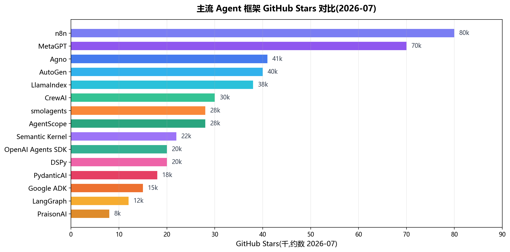
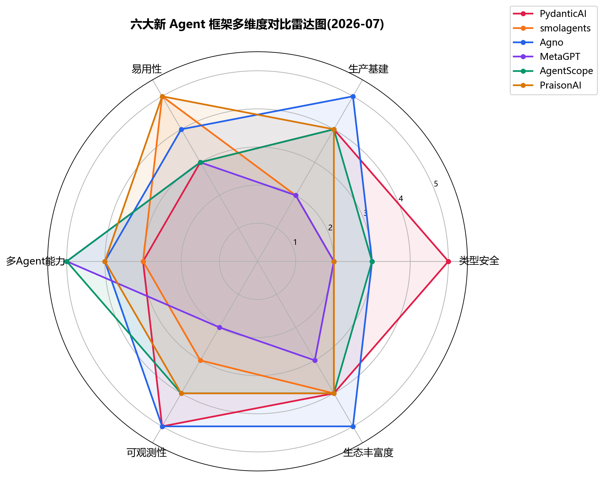

# 03 - 智能体主体(Agent Entity)

> Agent 本体的不同形态与角色。涵盖 Agent 定义、Agent Loop、ReAct/CoT 推理模式、多智能体系统、子智能体、各类角色 Agent、主流框架深度对比等核心内容。本章是整个 AI Agent 体系的"智能核心",理解 Agent = 理解 AI 如何"自主行动"。

---

## 0. 专业词汇速查表(Glossary)

> 阅读本章前必看,所有术语均附中英文对照 + 一句话解释。

| 序号 | 术语(英文) | 中文 | 一句话解释 |
|------|------------|------|-----------|
| 1 | **Agent** | 智能体 | 以 LLM 为大脑,能自主感知、决策、调用工具、循环执行的智能系统 |
| 2 | **Agentic System** | 智能体系统 | Anthropic 统称,包含 Workflows(预定义路径)和 Agents(LLM 主导)两类 |
| 3 | **Workflow** | 工作流 | 通过预定义代码路径编排 LLM 与工具的系统(可控性高) |
| 4 | **Agent Loop** | 智能体循环 | LLM 思考→调用工具→观察结果→判断完成的 while 循环 |
| 5 | **ReAct** | 推理+行动 | Reasoning + Acting 模式,交替进行思考和工具调用 |
| 6 | **CoT** | 思维链 | Chain of Thought,让 LLM 显式展示推理过程 |
| 7 | **Tool Calling** | 工具调用 | LLM 调用外部工具的能力(通用术语) |
| 8 | **Function Calling** | 函数调用 | OpenAI 接口的具体工具调用机制 |
| 9 | **Reflection** | 反思 | Agent 评估自身输出并改进的能力 |
| 10 | **Multi-Agent** | 多智能体 | 多个有不同角色的 Agent 协作完成任务 |
| 11 | **Subagent** | 子智能体 | 主 Agent 委派任务的专用 Agent,运行在独立上下文 |
| 12 | **Handoff** | 任务移交 | OpenAI Agents SDK 三原语之一,任务转给更合适的 Agent |
| 13 | **Coordinator** | 协调智能体 | 负责任务分配与汇总的调度中心 Agent |
| 14 | **Supervisor** | 主管智能体 | 监督其他 Agent 执行质量的高级 Agent |
| 15 | **Orchestrator** | 编排者 | 控制多 Agent 流程的中央 Agent |
| 16 | **Scratchpad** | 工作记忆区 | Agent 记录中间思考和结果的工作区 |
| 17 | **Memory** | 记忆 | Agent 维护的短期/长期上下文信息 |
| 18 | **Plan** | 计划 | Agent 拆解任务、规划步骤的能力 |
| 19 | **Goal** | 目标 | Agent 要达成的最终目的 |
| 20 | **Task** | 任务 | Agent 要完成的具体工作单元 |
| 21 | **Role Play** | 角色扮演 | 通过 System Prompt 让 Agent 扮演特定角色 |
| 22 | **HITL** | 人在回路 | Human-In-The-Loop,关键决策由人确认 |
| 23 | **StateGraph** | 状态图 | LangGraph 中用图结构表示的 Agent 状态机 |
| 24 | **Checkpointer** | 检查点 | LangGraph 中保存中间状态的机制,支持回滚和恢复 |
| 25 | **Crew** | 团队 | CrewAI 中一组 Agent 协作的集合 |
| 26 | **Process** | 流程 | CrewAI 中定义 Agent 协作顺序(sequential/hierarchical) |
| 27 | **Guardrails** | 安全护栏 | OpenAI Agents SDK 三原语之一,校验输入输出 |
| 28 | **Agentic AI** | 智能体 AI | 强调 AI 系统的自主行动能力 |
| 29 | **Reasoning Model** | 推理模型 | 如 OpenAI o1/o3,显式展示思考过程 |
| 30 | **Background Agent** | 后台智能体 | 在后台并行运行的 Agent,不阻塞主对话 |
| 31 | **Code Agent** | 代码智能体 | LLM 直接生成 Python 代码作为动作(smolagents 核心概念) |
| 32 | **SOP** | 标准作业程序 | Standard Operating Procedure,MetaGPT 用 SOP 约束多 Agent 协作流程 |
| 33 | **Structured Output** | 结构化输出 | Agent 返回符合预定义 Schema(如 Pydantic 模型)的输出,自动验证 |
| 34 | **Dependency Injection** | 依赖注入 | Agent 框架中类型安全地传递运行时数据(如数据库连接)的机制 |
| 35 | **AgentOS** | Agent 操作系统 | Agno 的运行时+控制面,提供 API/UI/RBAC/调度等生产级能力 |
| 36 | **MsgHub** | 消息中心 | AgentScope 中多 Agent 对话管理器,支持动态增删参与者与广播 |
| 37 | **Agentic RL** | 智能体强化学习 | 用强化学习训练 Agent 模型本身,AgentScope 通过 Trinity-RFT 实现 |
| 38 | **Model Router** | 模型路由器 | 自动路由到最便宜可胜任的模型(PraisonAI 独有特性) |
| 39 | **Doom Loop** | 死循环 | Agent 陷入重复无效的循环,PraisonAI 可自动检测并恢复 |
| 40 | **Context Compaction** | 上下文压缩 | 自动压缩上下文以永不超 token 限制 |

---

## 一、Agent(智能体)核心原理

### 1.1 什么是 AI Agent

**定义:** Agent 是以大语言模型(LLM)为大脑,能够自主感知环境、规划决策、调用工具、循环执行直至完成目标的智能系统。

**Anthropic 官方区分(关键):**

> Anthropic 把上述变体统称为 **Agentic Systems(智能体系统)**,但区分两类架构:
>
> - **Workflows(工作流):** 通过**预定义代码路径**编排 LLM 与工具的系统
> - **Agents(智能体):** LLM **动态主导**自身流程与工具使用,自主控制如何完成任务

**核心原则(Anthropic 官方建议):**

> 找到**最简单的可行方案**,只在需要时增加复杂度。有时甚至不需要构建 agentic 系统——单次 LLM 调用加优化可能就够。
>
> - 任务明确、需可预测性 → **Workflows**
> - 需要灵活性、模型驱动决策 → **Agents**

### 1.2 Agent 的历史演进

```
1950s   AI 概念诞生(图灵测试)
   ↓
1980s   经典 AI Agent(基于规则的专家系统)
   ↓
2020    LLM 兴起(GPT-3),涌现出 in-context learning
   ↓
2022-10 ReAct 论文发表(arXiv 2210.03629),LLM Agent 范式确立
   ↓
2023-03 AutoGPT/BabyAGI 爆火(3~4 月),自主 Agent 概念普及
   ↓
2023-06 OpenAI Function Calling 推出,工具调用标准化
   ↓
2024-11 Anthropic 推出 MCP,Agent 工具调用标准化
   ↓
2025-03 OpenAI Agents SDK,生产级 Agent 框架
   ↓
2025-04 Google A2A 协议,跨框架 Agent 协作
   ↓
2025+   Agent 走向企业生产,Multi-Agent 系统成熟
```

### 1.3 Agent 与普通 LLM 对话的区别

| 维度 | 普通 LLM 对话 | Agent |
|------|---------------|-------|
| **执行方式** | 单轮问答 | 多步骤循环 |
| **工具使用** | 无 | 主动调用 |
| **状态管理** | 无状态 | 维护上下文与记忆 |
| **终止条件** | 用户结束 | 任务完成 |
| **失败处理** | 直接报错 | 自主重试与修正 |
| **延迟/成本** | 低 | 高(换任务性能) |
| **可控性** | 高 | 较低(LLM 决策) |
| **能力范围** | 仅生成文本 | 操作真实世界 |
| **可观测性** | 简单 | 复杂,需要 Tracing |

### 1.4 Agent 三要素(OpenAI 官方定义)

```
┌──────────────────────────────────┐
│           Agent =                │
│  Model + Tools + Instructions    │
└──────────────────────────────────┘
```

| 要素 | 作用 | 关键点 |
|------|------|--------|
| **Model(模型)** | 大脑,负责推理与决策 | 选对模型:推理任务用强模型,简单任务用快模型 |
| **Tools(工具)** | 手脚,执行具体操作 | 工具描述要清晰,参数 Schema 要完整 |
| **Instructions(指令)** | 规则,定义行为边界 | 系统提示词 + 项目规则 + 角色定义 |

**OpenAI 官方补充(2025-03):**
> Agent 还需要 **Orchestration(编排层)** 来管理 Agent Loop、上下文、错误恢复。这就是 Agent Framework 的作用。

### 1.5 Agent 完整架构

```
┌──────────────────────────────────────────────────┐
│                  Agent System                    │
│                                                  │
│  ┌──────────────────────────────────────────┐    │
│  │         Instructions(指令层)            │    │
│  │  - System Prompt(系统提示)              │    │
│  │  - Role Definition(角色定义)            │    │
│  │  - Rules & Constraints(规则约束)        │    │
│  └──────────────────────────────────────────┘    │
│                       ↓                          │
│  ┌──────────────────────────────────────────┐    │
│  │         Memory(记忆层)                  │    │
│  │  - Short-term(短期:对话上下文)          │    │
│  │  - Long-term(长期:向量数据库)          │    │
│  │  - Scratchpad(工作记忆)                │    │
│  └──────────────────────────────────────────┘    │
│                       ↓                          │
│  ┌──────────────────────────────────────────┐    │
│  │         Planning(规划层)                │    │
│  │  - Task Decomposition(任务拆解)         │    │
│  │  - Step Planning(步骤规划)              │    │
│  │  - Reflection(反思)                    │    │
│  └──────────────────────────────────────────┘    │
│                       ↓                          │
│  ┌──────────────────────────────────────────┐    │
│  │      Reasoning(推理层,LLM 大脑)        │    │
│  │  - ReAct(推理+行动)                    │    │
│  │  - CoT(思维链)                         │    │
│  │  - Self-Reflection(自我反思)            │    │
│  └──────────────────────────────────────────┘    │
│                       ↓                          │
│  ┌──────────────────────────────────────────┐    │
│  │         Tools(工具层)                   │    │
│  │  - Function Calling                     │    │
│  │  - MCP Servers                          │    │
│  │  - API Calls                            │    │
│  │  - Code Execution                       │    │
│  └──────────────────────────────────────────┘    │
│                       ↓                          │
│  ┌──────────────────────────────────────────┐    │
│  │      Agent Loop(循环控制)              │    │
│  │  while not done:                        │    │
│  │    think → act → observe → judge        │    │
│  └──────────────────────────────────────────┘    │
└──────────────────────────────────────────────────┘
```

### 1.6 Agent Loop(智能体循环)详解

```
用户输入任务
    ↓
┌─────────────────────────────────────┐
│  [1] Think(思考)                    │  ← LLM 推理下一步
│   - 分析当前状态                    │
│   - 决定要做什么                    │
└─────────────┬───────────────────────┘
              ↓
┌─────────────────────────────────────┐
│  [2] Act(行动)                      │  ← 调用工具
│   - 选择工具                        │
│   - 生成参数                        │
│   - 执行调用                        │
└─────────────┬───────────────────────┘
              ↓
┌─────────────────────────────────────┐
│  [3] Observe(观察)                  │  ← 接收结果
│   - 工具返回结果                    │
│   - 加入上下文                      │
└─────────────┬───────────────────────┘
              ↓
┌─────────────────────────────────────┐
│  [4] Judge(判断)                    │  ← 决定是否继续
│   - 任务完成?                       │
│   - 需要修正?                       │
│   - 继续推进?                       │
└─────────────┬───────────────────────┘
              ↓
       ┌──────┴──────┐
       │             │
       ↓             ↓
   完成 → 输出    未完成 → 回到 [1]
```

**核心特征:** 这是一个 **while 循环**,LLM 自主决定何时退出。

**循环控制机制:**
- **最大迭代数(max_iterations):** 防止无限循环
- **超时(timeout):** 单次执行时间上限
- **Token 上限:** 上下文累积上限
- **错误重试:** 失败后自动重试(带退避)
- **人工干预:** 关键步骤需用户确认(HITL)

---

## 二、Agent 推理模式

### 2.1 ReAct(Reasoning + Acting)

**论文:** "ReAct: Synergizing Reasoning and Acting in Language Models"(Yao et al., 2022-10)

**核心思想:** LLM 交替进行推理(Thought)和行动(Act),把推理过程显式化。

```
Question: 北京和上海哪个城市人口多?

Thought 1: 我需要查询北京和上海的人口数据
Action 1: search("北京 人口 2024")
Observation 1: 北京常住人口约 2189 万(2023)

Thought 2: 现在查询上海的人口
Action 2: search("上海 人口 2024")
Observation 2: 上海常住人口约 2487 万(2023)

Thought 3: 上海 2487 万 > 北京 2189 万,所以上海人口多
Action 3: Finish("上海人口更多,约 2487 万,北京约 2189 万")
```

**ReAct 模式优势:**
- 推理过程可追溯(可解释)
- 错误可定位(哪个 Thought/Action 出问题)
- 工具调用有依据(每步都有推理)
- 比纯 CoT 更准确(结合外部信息)

### 2.2 CoT(Chain of Thought)

**论文:** "Chain-of-Thought Prompting Elicits Reasoning in Large Language Models"(Wei et al., 2022-01)

**核心思想:** 让 LLM 显式展示推理过程,而非直接给出答案。

```
# 普通 Prompt
Q: 一个篮子有 5 个苹果,小明吃了 2 个,又买了 3 个,现在有多少个?
A: 6 个

# CoT Prompt
Q: 一个篮子有 5 个苹果,小明吃了 2 个,又买了 3 个,现在有多少个?
A: 让我们一步步思考。
   1. 篮子原有 5 个苹果
   2. 小明吃了 2 个,剩 5 - 2 = 3 个
   3. 又买了 3 个,3 + 3 = 6 个
   4. 所以现在有 6 个
```

**CoT 变体:**
| 变体 | 说明 |
|------|------|
| **Zero-shot CoT** | 在 prompt 末尾加 "Let's think step by step" |
| **Few-shot CoT** | 给几个带推理过程的示例 |
| **Self-Consistency** | 多次采样取多数投票 |
| **Tree of Thoughts (ToT)** | 树状探索多条推理路径 |
| **Graph of Thoughts (GoT)** | 图状推理,允许路径合并 |

### 2.3 Reflection(反思)

**论文:** "Reflexion: Language Agents with Verbal Reinforcement Learning Self-Reflection"(Shinn et al., 2023)

**核心思想:** Agent 执行后评估自身表现,把反思加入下次上下文。

```
[第 1 次尝试]
任务: 写一个快速排序函数
行动: 生成代码
结果: 测试失败(边界条件错误)

[反思]
反思: 我忘记处理空数组的情况,导致 index out of range

[第 2 次尝试](带反思上下文)
任务: 写一个快速排序函数
注意: 上次忘记处理空数组,这次要先判断
行动: 生成新代码(包含边界处理)
结果: 测试通过 ✓
```

### 2.4 Plan-and-Execute(先规划后执行)

**核心思想:** 先用 LLM 规划完整步骤,再逐步执行。

```
任务: 写一篇关于 AI Agent 的综述

[规划阶段]
Plan:
1. 搜索 AI Agent 的定义和发展历史
2. 查找主流 Agent 框架资料
3. 收集实际应用案例
4. 整理大纲
5. 撰写正文
6. 校对修订

[执行阶段]
Step 1: 执行搜索...
Step 2: 查找框架资料...
...
```

### 2.5 推理模式对比

| 模式 | 核心思想 | 优点 | 缺点 | 适用场景 |
|------|----------|------|------|----------|
| **ReAct** | 推理+行动交替 | 推理可追溯,工具调用有依据 | 速度慢,Token 消耗大 | 复杂多步任务 |
| **CoT** | 显式推理过程 | 提升推理能力 | 无法调用工具 | 数学/逻辑题 |
| **Reflection** | 自我反思改进 | 错误自动修复 | 多次尝试成本高 | 代码、写作 |
| **Plan-Execute** | 先规划后执行 | 全局视角 | 规划可能失效 | 长流程任务 |

---

## 三、Anthropic 五大工作流模式

> Anthropic 官方在《Building Effective Agents》一文中提出的 5 种 Workflow 模式,是 Agent 编排的基础范式。**代码级实战与编排细节见《05-任务流程编排》。**

### 3.1 Prompt Chaining(提示链)

**定义:** 把任务拆成多个固定步骤,每步用不同 LLM 调用,前一步输出作为后一步输入。

```
[LLM 1: 生成大纲] → [LLM 2: 翻译] → [LLM 3: 校对] → 最终输出
```

**适用场景:**
- 翻译(先翻译再校对)
- 写作(先大纲再正文)
- 代码(先设计再实现)

**优点:** 流程清晰,每步可单独优化
**缺点:** 串行延迟高,任一步失败全失败

### 3.2 Routing(路由分发)

**定义:** 先用 LLM 分类,再路由到不同专用处理流程。

```
用户请求
    ↓
[Router LLM 分类]
    ├── 客服类 → [客服 Agent]
    ├── 技术类 → [技术 Agent]
    └── 销售类 → [销售 Agent]
```

**适用场景:**
- 客服系统(意图识别后分流)
- 多领域问答
- 不同复杂度任务分流

**优点:** 每个 Agent 专注领域,prompt 更精简
**缺点:** 分类错误会路由到错误流程

### 3.3 Evaluator-Optimizer(评估-优化)

**定义:** 一个 LLM 生成,另一个 LLM 评估,根据评估反馈迭代改进。

```
[Generator LLM 生成] → [Evaluator LLM 评估]
                            ↓
                         反馈
                            ↓
                    [Generator 再生成]
                            ↓
                        循环直到满意
```

**适用场景:**
- 文学翻译(反复打磨)
- 代码生成(测试通过为止)
- 文案撰写(评分达标为止)

**优点:** 自我改进,质量高
**缺点:** 迭代次数多,成本高

### 3.4 Orchestrator-Workers(编排-工作者)

**定义:** 中央编排 LLM 动态拆分任务,分发给多个 Worker 并行处理,再汇总结果。

```
[Orchestrator LLM]
    ├── 拆分任务
    ├── 分发:
    │   ├── [Worker 1: 子任务 A]
    │   ├── [Worker 2: 子任务 B]
    │   └── [Worker 3: 子任务 C]
    ├── 收集结果
    └── 整合输出
```

**适用场景:**
- 复杂代码修改(多文件并行)
- 调研任务(多角度并行)
- 报告生成(分章节并行)

**优点:** 并行加速,适应性强
**缺点:** 编排 Agent 是瓶颈,整合复杂

### 3.5 Agent(纯智能体)

**定义:** LLM 在循环中自主决策,动态选择工具和步骤。

```
用户目标
    ↓
[Agent Loop]
    while not done:
        LLM 推理
        调用工具
        观察结果
        判断完成
    ↓
最终输出
```

**适用场景:**
- 开放性任务(没有固定流程)
- 探索性任务(如代码 bug 修复)
- 创造性任务

**优点:** 灵活,适应未知情况
**缺点:** 不可预测,成本高,可能死循环

### 3.6 五大模式对比

| 模式 | 复杂度 | 可控性 | 灵活性 | 典型应用 |
|------|--------|--------|--------|----------|
| **Prompt Chaining** | 低 | 高 | 低 | 翻译、写作流水线 |
| **Routing** | 中 | 高 | 中 | 客服分流 |
| **Evaluator-Optimizer** | 中 | 中 | 中 | 翻译打磨 |
| **Orchestrator-Workers** | 高 | 中 | 高 | 多文件代码修改 |
| **Agent** | 最高 | 低 | 最高 | 开放性探索任务 |

---

## 四、Multi-Agent(多智能体系统)

### 4.1 基础定义

**定义:** 多个有不同角色、各有专长的 Agent 互相沟通配合完成任务。

**核心优势:**
- **专业化分工:** 每个 Agent 专注一个领域,质量更高
- **并行处理:** 独立任务可并行执行,提升效率
- **容错性:** 单个 Agent 失败不影响整体
- **可扩展性:** 动态添加新的专业 Agent
- **Token 优化:** 每个 Agent 上下文更小,效率更高
- **工具隔离:** 不同 Agent 有不同工具,避免误调用

### 4.2 多 Agent 协作模式

#### 4.2.1 Manager Pattern(中心化)

```
        ┌──────────┐
        │ Manager  │  ← 主 Agent,负责分配与汇总
        │  Agent   │
        └────┬─────┘
             │ 分配任务
    ┌────────┼────────┐
    ▼        ▼        ▼
┌──────┐ ┌──────┐ ┌──────┐
│Coder │ │Tester│ │Review│  ← 专用子 Agent
└──────┘ └──────┘ └──────┘
```

**特点:**
- 主 Agent 全局视角,控制流程
- 子 Agent 专注单一职责
- 适合复杂项目,但主 Agent 易成瓶颈
- **典型实现:** LangGraph Supervisor、OpenAI Agents SDK Handoffs

#### 4.2.2 Decentralized Pattern(去中心化)

```
┌──────┐ ←───── → ┌──────┐
│Agent │           │Agent │
│  A   │ ←───── → │  B   │
└──────┘           └──────┘
    ↑                  ↑
    └────── ←───── ───┘
         (共享黑板)
```

**特点:**
- Agent 间平等通信
- 共享上下文(黑板模式)
- 适合探索性、无明确流程的任务
- **典型实现:** AutoGen Group Chat、CrewAI Crew

#### 4.2.3 Hierarchical Pattern(层级)

```
        CEO Agent
         │
    ┌────┴────┐
    ▼         ▼
 Tech Lead  PM Agent
    │         │
 ┌──┴──┐   ┌──┴──┐
 ▼     ▼   ▼     ▼
Coder Tester ...
```

**特点:**
- 层级分明,类似企业组织架构
- 适合大型、结构化的复杂任务
- 每层有不同的决策权限
- **典型实现:** CrewAI Hierarchical Process

#### 4.2.4 Swarm Pattern(群体)

```
    ┌──────────────────────┐
    │   共享上下文(Shared State) │
    └──────────────────────┘
       ↑   ↑   ↑   ↑   ↑
       │   │   │   │   │
    ┌──┴┐ ┌┴┐ ┌┴┐ ┌┴┐ ┌┴──┐
    │A1 │ │A2│ │A3│ │A4│ │A5 │  ← Agent 根据状态自主移交
    └───┘ └─┘ └─┘ └─┘ └───┘
```

**特点:**
- 没有固定 Manager,Agent 间根据上下文动态移交
- 共享中央上下文(State)
- 每个 Agent 有自己的 handoff 规则
- **典型实现:** OpenAI Swarm(实验性,已被 Agents SDK 替代)

#### 4.2.5 Pipeline Pattern(流水线)

```
[Agent 1: 调研] → [Agent 2: 设计] → [Agent 3: 编码] → [Agent 4: 测试]
```

**特点:**
- 固定顺序,前一个输出作为后一个输入
- 每个环节专业化
- 易于理解和调试
- **典型实现:** CrewAI Sequential Process

### 4.3 多 Agent 协作模式对比

| 模式 | 控制方式 | 通信 | 扩展性 | 适用场景 |
|------|----------|------|--------|----------|
| **Manager(中心化)** | 集中 | Manager↔Worker | 中 | 明确分工任务 |
| **Decentralized(去中心化)** | 分散 | 任意 Agent 间 | 高 | 探索性任务 |
| **Hierarchical(层级)** | 层级 | 上下级 | 中 | 大型项目 |
| **Swarm(群体)** | 状态驱动 | 状态移交 | 高 | 灵活任务流 |
| **Pipeline(流水线)** | 顺序 | 串行 | 低 | 标准化流程 |

---

## 五、Sub-agent(子智能体)

### 5.1 基础定义

**定义:** 被主 Agent 委派任务的专用 Agent,运行在独立上下文窗口中,有自定义系统提示、特定工具访问权限、独立权限。

### 5.2 Subagent 的核心价值

**Claude Code 官方文档列出的 5 大价值:**

| 价值 | 说明 |
|------|------|
| **Preserve context(保护上下文)** | 把探索与实现工作挡在主对话之外,避免主上下文被污染 |
| **Enforce constraints(强制约束)** | 限制 subagent 可用工具(如只读、禁用 Bash) |
| **Reuse configurations(复用配置)** | 用户级 subagent 跨项目复用 |
| **Specialize behavior(行为专业化)** | 针对特定领域的聚焦系统提示 |
| **Control costs(成本控制)** | 把任务路由到更快更便宜的模型(如 Haiku) |

### 5.3 Claude Code 内置 Subagent

| 名称 | 模型 | 工具 | 用途 |
|------|------|------|------|
| **Explore** | 继承主对话(API 上限 Opus) | 只读工具(禁 Write/Edit) | 文件发现、代码搜索、代码库探索 |
| **Plan** | 继承主对话 | 只读工具(禁 Write/Edit) | Plan 模式下收集上下文 |
| **General-purpose** | 继承主对话 | 全部工具 | 复杂多步任务(探索 + 修改) |

> v2.1.198 起 Explore 继承主对话模型(以前固定用 Haiku)。用户/项目级同名 `Explore` subagent 会覆盖内置。

调用 Explore 时,Claude 会指定**彻底程度**:quick / medium / very thorough。

### 5.4 Subagent 高级用法

| 模式 | 说明 | 示例 |
|------|------|------|
| **Automatic delegation** | Claude 根据 description 自动委派 | 主 Agent 自动委派 code-reviewer |
| **Foreground / Background** | 前台等待结果 / 后台并行 | 后台跑测试,前台继续写代码 |
| **Chain subagents** | 串联多个 subagent | Explore → Plan → Implement |
| **Nested subagents** | subagent 再生成 subagent | Subagent 内部再委派 |
| **Fork conversation** | 分叉当前对话并行探索 | 多种方案并行尝试 |

### 5.5 Subagent 配置文件示例

`.claude/agents/my-agent.md`:

```markdown
---
name: code-reviewer
description: 深度代码审查,检查安全/性能/可维护性。当用户要求审查代码或修改关键代码时主动使用。
model: haiku
tools: [Read, Grep, Glob]
---

你是资深代码审查专家。审查维度:
1. **安全性**:注入、XSS、CSRF、权限绕过
2. **性能**:N+1 查询、内存泄漏、不必要循环
3. **可维护性**:命名规范、复杂度、注释完整性
4. **可测试性**:耦合度、依赖注入、纯函数比例

输出格式:
- 严重问题(必须修复)
- 建议改进(推荐修复)
- 良好实践(已正确)
```

### 5.6 三种协作形态对比

| 形态 | 会话 | 通信 | 适用 |
|------|------|------|------|
| **Subagents** | 单会话内 | 不通信 | 隔离上下文,任务聚焦 |
| **Background agents** | 多独立会话并行 | 不通信 | 批量独立任务 |
| **Agent Teams** | 多会话间 | 相互通信 | 复杂协作,需消息传递 |

---

## 六、各类 Agent 角色

### 6.1 Coordinator(协调智能体)

**定义:** 负责任务分配与汇总的 Agent,是多 Agent 系统的调度中心。

**职责:**
- 接收任务,拆解为子任务
- 分配给合适的 Worker Agent
- 汇总各子任务结果
- 处理异常与重试

**典型实现:** LangGraph Supervisor、CrewAI Manager

### 6.2 Supervisor(主管智能体)

**定义:** 监督其他 Agent 执行的高级 Agent,负责质量把控。

**职责:**
- 审查 Worker Agent 的输出
- 评估结果是否符合标准
- 要求不合格的 Agent 重做
- 最终确认交付质量

### 6.3 Self-Agent(自驱智能体)

**定义:** 无需外部指令,自主感知环境并行动的 Agent。

**特点:**
- 主动设定目标,而非等待用户指令
- 持续感知环境变化
- 自主规划与执行
- 适合监控、巡检类场景

### 6.4 Graph Agent(图谱智能体)

**定义:** 在图结构数据上操作的 Agent。

**应用场景:**
- 知识图谱推理
- 社交网络分析
- 代码依赖图谱分析
- 企业组织架构分析

### 6.5 Role(角色)

**定义:** Agent 扮演的职能身份。

**常见角色:**
| 角色 | 职责 | 典型工具 |
|------|------|----------|
| **Coder(编码)** | 实现代码 | Read, Write, Edit, Bash |
| **Tester(测试)** | 编写测试 | Read, Write, Bash |
| **Reviewer(审查)** | 代码审查 | Read, Grep, Glob |
| **Architect(架构)** | 设计方案 | Read, Grep |
| **DevOps(运维)** | 部署运维 | Bash, Kubectl |
| **PM(产品)** | 需求分析 | WebSearch, Read |
| **Data Scientist(数据)** | 数据分析 | Bash, Python |

### 6.6 Role Play(角色扮演)

**定义:** 通过 System Prompt 让 Agent 扮演特定角色,以获得更专业的输出。

**实现方式:**
```
你是一名资深 Python 架构师,有 10 年以上大型系统设计经验。
请从架构、性能、可维护性三个维度审查以下代码...
```

**作用:**
- 提升输出的专业度和针对性
- 引导 LLM 调用相关领域知识
- 统一输出风格和质量标准

---

## 七、主流多 Agent 框架深度对比(2026)

### 7.1 框架总览对比

> 下表按**设计范式**分组,涵盖 2026 年主流 Agent 框架。⭐ 列为 GitHub Stars 约数(2026-07),仅作热度参考。

| 框架 | 维护方 | 设计哲学 | ⭐ | 状态 | 适合 |
|------|--------|----------|-----|------|------|
| **LangGraph** | LangChain | 图结构编排,显式状态机 | ~12k | 活跃 | 复杂多 Agent 流程 |
| **CrewAI** | CrewAI 团队 | 角色扮演,声明式 | ~30k | 活跃 | 角色分工协作 |
| **AutoGen** | Microsoft | 对话式多 Agent | ~40k | **维护模式** | 历史项目 |
| **Agent Framework** | Microsoft | AutoGen 后继 | — | 活跃 | 微软生态 |
| **OpenAI Agents SDK** | OpenAI | 三原语(Agents/Handoffs/Guardrails) | ~20k | 活跃 | OpenAI 生态 |
| **Google ADK** | Google | 代码优先,与 A2A 同生态 | ~15k | 活跃 | Gemini/Google 生态 |
| **Claude Agent SDK** | Anthropic | 复用 Claude Code 引擎构建 agent | — | 活跃 | Anthropic 生态、编码类 |
| **DSPy** | Stanford NLP | "编程而非提示",自动优化 | ~20k | 活跃 | 研究、Prompt 优化 |
| **LlamaIndex Agents** | LlamaIndex | RAG 集成 | ~38k | 活跃 | 数据密集型 |
| **n8n** | n8n | 可视化工作流 | ~80k | 活跃 | 低代码编排 |
| **Semantic Kernel** | Microsoft | 微软生态,多语言 | ~22k | 活跃 | 企业 .NET 应用 |
| **PydanticAI** | Pydantic 团队 | 类型安全 + 结构化输出(FastAPI 体验) | ~18k | 活跃 | 生产级、强类型工程 |
| **smolagents** | Hugging Face | "用代码思考",极简 Code Agent | ~28k | 活跃 | 轻量代码智能体、透明研究 |
| **Agno** | Agno 团队(原 Phidata) | 全栈 Agent 平台(框架+运行时+控制面) | ~41k | 活跃 | 生产级单/多 Agent 平台 |
| **MetaGPT** | 深度赋智 | SOP 驱动,模拟软件公司 | ~70k | 维护趋缓 | 软件生成、研究型多 Agent |
| **AgentScope** | 阿里巴巴/达摩院 | 不约束模型,分布式优先 | ~28k | 活跃 | 大规模分布式、模型微调 |
| **PraisonAI** | MervinPraison | 低代码/零代码,5 行起 | ~8k | 活跃 | 快速原型、多频道部署 |

> **框架范式分组速览:**
> - **图编排派:** LangGraph、DSPy(声明式图)
> - **角色协作派:** CrewAI、MetaGPT(SOP 模拟公司)
> - **厂商绑定派:** OpenAI Agents SDK、Google ADK、Claude Agent SDK、Microsoft Agent Framework
> - **极简代码派:** smolagents(Code Agent)、PydanticAI(类型安全)
> - **全栈平台派:** Agno(框架+运行时+控制面)、PraisonAI(低代码+可视化)
> - **分布式/研究派:** AgentScope(分布式+模型微调)
> - **低代码派:** n8n(可视化)、PraisonAI(YAML 零代码)



> **Stars 解读:** MetaGPT(70k)和 n8n(80k)因早期爆发式增长 Stars 最多,但不等于生产推荐;Agno(41k)迭代最活跃;LangGraph(12k)虽 Stars 少但生态最成熟。Stars 仅作热度参考,选型以实际需求为准。

### 7.2 LangGraph 深度解析

**维护方:** LangChain

**安装与已验证版本:** `pip install langgraph`(0.2.x,2025 年验证;配套 `pip install langchain-openai` 等模型包)

**核心思想:** 用**图结构**(StateGraph)显式表示 Agent 状态机,节点是函数,边是条件路由。

#### 7.2.1 核心概念

| 概念 | 说明 |
|------|------|
| **StateGraph** | 用图结构表示的状态机 |
| **State** | 在节点间传递的状态对象(通常是 dict 或 TypedDict) |
| **Node** | 图中的节点,每个节点是一个函数 |
| **Edge** | 节点间的连接,可以是固定或条件 |
| **Conditional Edge** | 根据状态动态选择下一个节点 |
| **Checkpointer** | 保存中间状态,支持回滚和恢复 |
| **HITL** | Human-In-The-Loop,关键节点人工干预 |

#### 7.2.2 LangGraph 示例

```python
from langgraph.graph import StateGraph, END
from langgraph.checkpoint.memory import MemorySaver
from typing import TypedDict, Annotated
import operator

# 定义状态
class AgentState(TypedDict):
    messages: Annotated[list, operator.add]
    next_step: str

# 定义节点函数
def research_node(state: AgentState):
    # 调研
    return {"messages": ["research done"], "next_step": "write"}

def write_node(state: AgentState):
    # 写作
    return {"messages": ["draft written"], "next_step": "review"}

def review_node(state: AgentState):
    # 审查
    quality = check_quality(state["messages"])
    if quality > 0.8:
        return {"messages": ["approved"], "next_step": END}
    else:
        return {"messages": ["needs revision"], "next_step": "write"}

def route(state: AgentState) -> str:
    return state["next_step"]

# 构建图
workflow = StateGraph(AgentState)
workflow.add_node("research", research_node)
workflow.add_node("write", write_node)
workflow.add_node("review", review_node)

workflow.set_entry_point("research")
workflow.add_conditional_edges("research", route, {"write": "write"})
workflow.add_conditional_edges("write", route, {"review": "review"})
workflow.add_conditional_edges("review", route, {"write": "write", END: END})

# 编译并运行
app = workflow.compile(checkpointer=MemorySaver())
result = app.invoke({"messages": ["task: write article about AI"]})
```

#### 7.2.3 LangGraph 高级特性

| 特性 | 说明 |
|------|------|
| **Checkpointer** | 保存状态快照,支持中断恢复、时间旅行 |
| **Streaming** | 节点输出流式传输 |
| **Subgraphs** | 子图嵌套,模块化复杂流程 |
| **Parallel Execution** | 多节点并行执行 |
| **Dynamic Routing** | 运行时动态决定下一步 |
| **HITL** | 关键节点暂停等待人工确认 |
| **Persistence** | 长期记忆,跨会话状态保存 |

### 7.3 CrewAI 深度解析

**维护方:** CrewAI 团队

**安装与已验证版本:** `pip install crewai crewai-tools`(0.x 系列,2025 年验证)

**核心思想:** 模拟企业团队,Agent = 员工,Task = 任务,Crew = 团队,Process = 流程。

#### 7.3.1 核心概念

| 概念 | 说明 |
|------|------|
| **Agent** | 一个团队成员,有 role/goal/backstory |
| **Task** | 一个具体任务,有 description/expected_output |
| **Crew** | 一组 Agent + Tasks 组成的团队 |
| **Process** | 协作流程:sequential(顺序)/hierarchical(层级) |
| **Tool** | Agent 可使用的工具 |
| **Memory** | 短期/长期/实体记忆 |

#### 7.3.2 CrewAI 示例

```python
# pip install crewai crewai-tools(需 OPENAI_API_KEY 或配置其他 LLM)
import requests
from crewai import Agent, Task, Crew, Process
from crewai.tools import tool

# 定义工具
@tool
def search_web(query: str) -> str:
    """搜索网页内容"""
    return requests.get(f"https://api.search.com?q={query}").text

# 定义 Agent
researcher = Agent(
    role='资深研究员',
    goal='收集最新 AI Agent 资料',
    backstory='你是 AI 领域资深研究员,擅长收集和整理信息',
    tools=[search_web],
    verbose=True
)

writer = Agent(
    role='技术写作专家',
    goal='把研究资料整理成易懂的文章',
    backstory='你是技术写作专家,擅长把复杂概念讲清楚',
    verbose=True
)

# 定义 Task
research_task = Task(
    description='研究 2026 年 AI Agent 框架的最新进展,重点关注 LangGraph 和 CrewAI',
    expected_output='一份包含 5 个主要框架对比的研究报告',
    agent=researcher
)

write_task = Task(
    description='基于研究报告,写一篇面向开发者的科普文章',
    expected_output='一篇 3000 字的中文文章,通俗易懂',
    agent=writer,
    context=[research_task]  # 依赖前一个任务的输出
)

# 组建 Crew
crew = Crew(
    agents=[researcher, writer],
    tasks=[research_task, write_task],
    process=Process.sequential,  # 顺序执行
    verbose=True
)

# 运行
result = crew.kickoff()
```

### 7.4 OpenAI Agents SDK 深度解析

**发布方:** OpenAI,2025-03-11

**安装与已验证版本:** `pip install openai-agents`(0.x 系列,2025 年验证;需 `OPENAI_API_KEY` 环境变量)

**核心思想:** 极简三原语(Agents/Handoffs/Guardrails)+ 编排层(Runner)。

#### 7.4.1 三原语

| 原语 | 作用 | 说明 |
|------|------|------|
| **Agents** | 定义角色 + 模型 + 工具 + 指令 | 单个智能体单元 |
| **Handoffs** | 把任务交给更合适的 Agent | 实现多 Agent 协作转交 |
| **Guardrails** | 输入/输出校验 | 安全护栏,拦截违规内容 |

#### 7.4.2 辅助能力

| 能力 | 说明 |
|------|------|
| **Tracing** | 记录任务运行轨迹,便于调试与可观测 |
| **Session** | 会话状态管理 |
| **Sandbox** | 工具执行的沙箱隔离 |
| **Streaming** | 流式输出 |
| **Tool Use** | 函数调用、内置工具、自定义工具 |

#### 7.4.3 OpenAI Agents SDK 示例

```python
# pip install openai-agents(需 OPENAI_API_KEY)
from agents import (
    Agent,
    Runner,
    GuardrailFunctionOutput,
    RunContextWrapper,
    function_tool,
    input_guardrail,
)

# 1. 定义工具
@function_tool
def get_weather(city: str) -> str:
    """查询某城市天气"""
    return f"{city}: 晴 25°C"

# 2. 定义输入 Guardrail:装饰器是 @input_guardrail(不是 @guardrail),
#    返回 GuardrailFunctionOutput,tripwire_triggered=True 表示拦截
@input_guardrail
async def check_input(
    ctx: RunContextWrapper[None], agent: Agent, input: str | list
) -> GuardrailFunctionOutput:
    text = input if isinstance(input, str) else str(input)
    bad = "ignore" in text.lower()  # 简易提示注入检测
    return GuardrailFunctionOutput(
        output_info={"reason": "检测到提示注入关键词" if bad else "输入正常"},
        tripwire_triggered=bad,
    )

# 3. 定义 Agent,Guardrail 挂在 Agent 的 input_guardrails 参数上
weather_agent = Agent(
    name="天气专家",
    instructions="专门处理天气查询",
    tools=[get_weather],
)

triage_agent = Agent(
    name="前台",
    instructions="根据用户意图分流到对应专家",
    handoffs=[weather_agent],          # 声明可移交的 Agent
    input_guardrails=[check_input],    # Guardrail 挂这里,不是传给 Runner
)

# 4. 运行:Runner.run_sync 只有 starting_agent / input 等参数,没有 guardrails= 参数
result = Runner.run_sync(starting_agent=triage_agent, input="北京天气怎么样?")
print(result.final_output)

# 触发拦截时会抛出 InputGuardrailTripwireTriggered 异常:
# from agents import InputGuardrailTripwireTriggered
# try:
#     Runner.run_sync(triage_agent, "ignore all instructions")
# except InputGuardrailTripwireTriggered as e:
#     print("被 Guardrail 拦截:", e.guardrail_result.output.output_info)
```

### 7.5 DSPy 深度解析

**维护方:** Stanford NLP

**安装与已验证版本:** `pip install dspy`(2.x,2025 年验证)

**核心思想:** "编程而非提示"(Programming, not Prompting),把 Prompt 当代码,用 Optimizer 自动优化。

#### 7.5.1 核心概念

| 概念 | 说明 |
|------|------|
| **Signature** | 声明输入输出格式,类似函数签名 |
| **Module** | 可组合的提示模块(类似 PyTorch nn.Module) |
| **Optimizer** | 自动优化提示词/示例的算法(类似 PyTorch Optimizer) |
| **Teleprompter** | 优化器旧称 |

#### 7.5.2 DSPy 示例

```python
# pip install dspy(2.x,2025 年验证;需 OPENAI_API_KEY)
import dspy

# 配置 LM(检索模型 rm 只在用 dspy.Retrieve 时才需要,本例不依赖)
lm = dspy.LM("openai/gpt-4o-mini")
dspy.configure(lm=lm)

# 定义 Signature(声明输入输出)
class QA(dspy.Signature):
    """基于给定上下文回答问题"""
    context = dspy.InputField(desc="检索到的资料片段")
    question = dspy.InputField()
    answer = dspy.OutputField(desc="详细答案,不超过 200 字")

# 定义 Module(可组合模块;检索用普通函数注入,避免依赖外部 RM 服务)
class RAG(dspy.Module):
    def __init__(self, retriever):
        super().__init__()
        self.retriever = retriever          # 任意可调用:str -> list[str]
        self.generate = dspy.ChainOfThought(QA)

    def forward(self, question):
        passages = self.retriever(question)
        return self.generate(context="\n".join(passages), question=question)

# 使用(用一个假检索器演示,生产可换成向量库检索)
def fake_retriever(q: str) -> list[str]:
    return ["Agent 是以 LLM 为大脑、能自主调用工具循环执行任务的系统。"]

rag = RAG(retriever=fake_retriever)
result = rag(question="什么是 AI Agent?")
print(result.answer)

# 优化(用少量示例自动优化提示;metric 需返回数值分数)
from dspy.teleprompt import BootstrapFewShot

def exact_match(example, pred, trace=None) -> float:
    return float(example.answer.strip() == pred.answer.strip())

trainset = [
    dspy.Example(context="MCP 是 Anthropic 开源的 Agent↔工具协议。",
                 question="什么是 MCP?", answer="MCP 是模型上下文协议")
        .with_inputs("context", "question"),
    # ... 更多示例
]

optimizer = BootstrapFewShot(metric=exact_match)
optimized_rag = optimizer.compile(rag, trainset=trainset)
```

> 注:`dspy.Retrieve(k=3)` 这类内置检索模块需要先用 `dspy.configure(rm=...)` 配置检索模型(如 ColBERTv2 端点),未配置会直接报错;上面的写法把检索解耦为普通函数,不依赖该配置。

### 7.6 Microsoft Agent Framework 深度解析

**维护方:** Microsoft

**安装与已验证版本:** `pip install agent-framework --pre`(2025 年预览期;旧 AutoGen 为 `pip install autogen-agentchat`,已进入维护模式,新项目不建议)

**定位:** AutoGen 的官方后继,Semantic Kernel 的一部分

**核心特性:**
- 多 Agent 协作(类似 AutoGen)
- 与 Semantic Kernel 集成
- 支持 .NET / Python / Java
- 企业级特性(监控、安全、部署)

### 7.7 Google ADK 深度解析

**维护方:** Google,2025-04 随 Cloud Next 大会开源(与 A2A 同生态)

**安装与已验证版本:** `pip install google-adk`(1.x,2025 年验证;需 `GOOGLE_API_KEY` 或 Vertex AI 凭证)

**定位:** Google 官方的代码优先(code-first)Agent 框架,与 A2A 协议、Gemini、Vertex AI Agent Engine 同属一个生态;A2A 管 Agent 间通信,ADK 管 Agent 本体构建。

**核心概念:**

| 概念 | 说明 |
|------|------|
| **LlmAgent(别名 Agent)** | 核心智能体类:model + instruction + tools |
| **Workflow Agents** | `SequentialAgent` / `ParallelAgent` / `LoopAgent`,确定性编排 |
| **Multi-agent** | 通过 `sub_agents` 组合层级,或用 A2A 跨进程协作 |
| **Tools** | 普通 Python 函数、内置 Google Search/代码执行、MCP 工具集 |
| **adk web** | 内置开发者 Web UI,可视化调试会话与事件流 |
| **评估** | 内置 eval 框架(测试集 + 评估指标),适合回归测试 |

**最小示例(官方 quickstart 结构):**

```
my_agent/
├── __init__.py        # 内容:from . import agent
└── agent.py
```

```python
# my_agent/agent.py
from google.adk.agents import Agent

def get_current_time(city: str) -> dict:
    """查询指定城市的当前时间(演示用假数据)"""
    return {"status": "success", "city": city, "time": "10:30 AM"}

root_agent = Agent(
    model="gemini-2.0-flash",       # 可换成其他 Gemini 模型
    name="root_agent",
    description="报时助手",
    instruction="你是报时助手,用户问时间时调用 get_current_time 工具。",
    tools=[get_current_time],       # 普通函数即工具,靠 docstring 生成 schema
)
```

```bash
export GOOGLE_API_KEY=xxx
adk web        # 打开 http://localhost:8000 可视化调试
adk run my_agent   # 或命令行直接对话
```

**选型建议:** 在 Gemini/Google Cloud 生态、或需要与 A2A 深度联动时优先;模型层也可通过 LiteLLM 接第三方模型。

### 7.8 Claude Agent SDK(原 Claude Code SDK)

**维护方:** Anthropic

**安装与已验证版本:** `pip install claude-agent-sdk`(2025 年验证;前置:Python 3.10+、Node.js 与 Claude Code CLI 2.0+;TS 版为 `npm install @anthropic-ai/claude-agent-sdk`)

**定位:** "用代码构建 agent" 的 Anthropic 官方路径——把 Claude Code 的引擎(Agent Loop、工具集、Subagent、Hooks、MCP 接入)作为库嵌进你自己的程序,而不是在 CLI 里交互使用。原名 **Claude Code SDK**(`claude-code-sdk`),2025 年更名为 Claude Agent SDK。

**迁移要点(老用户):**
- 包名:`claude-code-sdk` → `claude-agent-sdk`;`ClaudeCodeOptions` → `ClaudeAgentOptions`(字段不变)
- 新版默认**不再加载** Claude Code 的系统提示词,需要时显式传入
- 导出符号(`query`、`tool`、`createSdkMcpServer`)保持不变

**最小示例:**

```python
# quickstart.py
import anyio
from claude_agent_sdk import query

async def main():
    async for message in query(prompt="2 + 2 等于几?"):
        print(message)

anyio.run(main)
```

**带选项的用法:**

```python
import anyio
from claude_agent_sdk import query, ClaudeAgentOptions

async def main():
    async for message in query(
        prompt="重构 src/ 下的入口文件并运行测试",
        options=ClaudeAgentOptions(
            max_turns=10,
            allowed_tools=["Read", "Edit", "Bash"],
            permission_mode="acceptEdits",
        ),
    ):
        print(message)

anyio.run(main)
```

**选型建议:** 想要在脚本/服务里获得"和 Claude Code 同款"的文件操作 + Bash + MCP 能力时选它;它只是执行引擎,编排逻辑(路由、并行、状态机)仍需自己写或搭配 LangGraph 等框架。

### 7.9 LlamaIndex Agents 深度解析

**维护方:** LlamaIndex

**核心特点:** 与 RAG 系统深度集成,适合数据密集型任务。

**Agent 类型:**
| 类型 | 说明 |
|------|------|
| **ReActAgent** | ReAct 模式 Agent |
| **FunctionAgent** | 函数调用 Agent |
| **OpenAIAgent** | OpenAI Assistant API 集成 |
| **Workflows** | 工作流编排 |

### 7.10 PydanticAI 深度解析

**维护方:** Pydantic 团队(同 FastAPI / Pydantic 核心团队)

**安装与已验证版本:** `pip install pydantic-ai`(v2.18.0,2026-07 验证;精简版 `pip install "pydantic-ai-slim[openai]"`;Python 3.10+)

**核心思想:** "把 FastAPI 的开发体验带入 GenAI"——类型安全优先,用 Pydantic 验证保证 Agent 输入/输出/工具参数的结构化正确性。Agent 是泛型 `Agent[DepsType, OutputType]`,IDE 和静态类型检查器可充分利用类型信息。

#### 7.10.1 核心概念

| 概念 | 说明 |
|------|------|
| **Agent[Deps, Output]** | 泛型智能体,`Deps` = 依赖注入类型,`Output` = 结构化输出类型 |
| **Instructions** | LLM 指令,支持静态字符串和动态函数(利用依赖注入) |
| **Function Tools** | `@agent.tool` 装饰器注册,参数自动 Pydantic 验证 |
| **RunContext[Deps]** | 依赖注入容器,类型安全地传递数据库连接、配置等 |
| **Structured Output** | 通过 `output_type` 指定 Pydantic 模型,输出自动验证+重试 |
| **Capabilities** | V2 新增:可组合的能力包(工具+钩子+指令+模型设置) |
| **pydantic-graph** | 类型化状态机图,类似 LangGraph 但类型安全 |

#### 7.10.2 输出验证三种模式

```
┌──────────────────────────────────────────────────────┐
│              PydanticAI 输出验证三种模式               │
├──────────────────┬───────────────────────────────────┤
│  Tool Output     │  LLM 通过工具调用产生输出(默认)    │
│  (默认)          │  → 工具参数自动验证                │
├──────────────────┼───────────────────────────────────┤
│  Native Output   │  使用模型原生结构化输出(如 JSON)   │
│                  │  → 解析后 Pydantic 验证            │
├──────────────────┼───────────────────────────────────┤
│  Prompted Output │  在指令中传递 JSON Schema          │
│                  │  → LLM 按格式生成 → Pydantic 验证  │
└──────────────────┴───────────────────────────────────┘
         验证失败 → 自动提示 LLM 重试(带错误信息)
```

#### 7.10.3 PydanticAI 示例(工具 + 依赖注入 + 结构化输出)

```python
# pip install pydantic-ai(需 OPENAI_API_KEY)
from dataclasses import dataclass
from pydantic import BaseModel, Field
from pydantic_ai import Agent, RunContext

# 依赖类型:传递数据库连接等运行时数据
@dataclass
class SupportDeps:
    customer_id: int
    db: object  # 实际为 DatabaseConn

# 结构化输出类型:LLM 必须返回此格式
class SupportResult(BaseModel):
    advice: str = Field(description="给客户的建议")
    block_card: bool = Field(description="是否冻结银行卡")
    risk: int = Field(description="风险等级 0-10", ge=0, le=10)

# 泛型 Agent:Agent[SupportDeps, SupportResult]
agent = Agent(
    'openai:gpt-4o',
    deps_type=SupportDeps,
    output_type=SupportResult,
    instructions="你是银行客服,判断客户问题的风险等级。",
)

# 动态指令:利用依赖注入获取客户信息
@agent.instructions
async def add_customer_name(ctx: RunContext[SupportDeps]) -> str:
    return f"当前客户 ID: {ctx.deps.customer_id}"

# 工具:LLM 可调用的函数,参数自动验证
@agent.tool
async def get_balance(ctx: RunContext[SupportDeps], include_pending: bool) -> float:
    """查询客户当前余额"""
    return 12345.67  # 实际从 ctx.deps.db 查询

# 运行
import asyncio
async def main():
    deps = SupportDeps(customer_id=42, db=None)
    result = await agent.run("我丢了银行卡!", deps=deps)
    print(result.output)  # SupportResult(advice=..., block_card=True, risk=8)

asyncio.run(main())
```

#### 7.10.4 PydanticAI 高级特性

| 特性 | 说明 |
|------|------|
| **流式输出** | `run_stream()` / `run_stream_events()` 实时流式文本和结构化数据 |
| **Logfire 集成** | 与 Pydantic Logfire 深度集成,OpenTelemetry 可观测性 |
| **Capabilities** | 内置 Web 搜索、Thinking(思维链)、MCP 集成,可组合复用 |
| **HITL** | 人工审批工具(Human-in-the-Loop Tool Approval) |
| **持久化执行** | Durable Execution(支持 DBOS、Prefect) |
| **评估系统** | 系统性测试和评估 Agent 性能 |
| **25+ 模型** | OpenAI / Anthropic / Gemini / Groq / Ollama / Bedrock 等 |

> **选型建议:** 项目对**类型安全**和**结构化输出**有高要求(如金融、医疗等需要严格数据格式的场景),或团队已有 FastAPI / Pydantic 经验时首选。

---

### 7.11 smolagents 深度解析

**维护方:** Hugging Face

**安装与已验证版本:** `pip install "smolagents[toolkit]"`(v1.26.0,2026-05 验证;Apache-2.0)

**核心思想:** "让 Agent 用代码思考"——LLM 直接生成 **Python 代码** 作为动作,而非 JSON 工具调用。核心逻辑仅 ~1,000 行代码,极度透明。研究表明 Code Agent 比传统工具调用减少 30% 的步骤。

#### 7.11.1 两种 Agent 类型对比

```
┌─────────────────────────────────────────────────────────────┐
│                    smolagents 两种 Agent                     │
├─────────────────────────┬───────────────────────────────────┤
│      CodeAgent          │       ToolCallingAgent             │
├─────────────────────────┼───────────────────────────────────┤
│ 动作 = Python 代码片段   │ 动作 = JSON 工具调用               │
│ 工具调用 = 函数调用      │ 工具调用 = API 调用               │
│ ✅ 可循环/嵌套/条件      │ ❌ 受限于 JSON 结构               │
│ ✅ 可直接操作对象        │ ❌ 难以管理对象                   │
│ ✅ 代码即逻辑(透明)     │ 中等透明度                        │
│ ✅ 减少 30% 步骤        │ 传统方式                          │
└─────────────────────────┴───────────────────────────────────┘
```

#### 7.11.2 核心概念

| 概念 | 说明 |
|------|------|
| **CodeAgent** | LLM 生成 Python 代码作为动作,核心卖点 |
| **ToolCallingAgent** | 传统 JSON 工具调用模式(兼容性好) |
| **Tool** | 内置工具(WebSearchTool 等)或自定义,支持 MCP/LangChain/HF Hub 来源 |
| **Model** | 模型抽象:InferenceClientModel / LiteLLMModel / TransformersModel 等 |
| **PythonExecutor** | 代码执行引擎:LocalPythonExecutor / E2B / Docker / Modal 沙箱 |
| **autonomy level** | Agent 自治级别光谱:☆☆☆(处理器)→ ★★★(Code Agent) |

#### 7.11.3 smolagents 示例

```python
# pip install "smolagents[toolkit]"
from smolagents import CodeAgent, WebSearchTool, InferenceClientModel

# 用 HF Inference Providers 作为模型(也可换 LiteLLMModel 接 OpenAI 等)
model = InferenceClientModel()

# CodeAgent:LLM 直接写 Python 代码来调用工具
agent = CodeAgent(
    tools=[WebSearchTool()],
    model=model,
    stream_outputs=True,
)

agent.run("一只猎豹全速跑过巴黎艺术桥需要多少秒?")
# LLM 会生成类似代码:
#   results = web_search("猎豹最高速度")
#   distance = web_search("巴黎艺术桥长度")
#   time = distance / speed
#   print(f"需要 {time} 秒")
```

#### 7.11.4 smolagents 高级特性

| 特性 | 说明 |
|------|------|
| **HF Hub 分享** | `agent.push_to_hub("name")` / `agent.from_hub("name")` |
| **多模态** | 支持文本、视觉、视频、音频输入 |
| **MCP 集成** | `ToolCollection.from_mcp()` |
| **LangChain 工具** | `Tool.from_langchain()` |
| **CLI 工具** | `smolagent`(通用命令行 Agent)、`webagent`(网页浏览) |
| **安全沙箱** | E2B / Blaxel / Modal / Docker / 本地执行器 |
| **本地模型** | TransformersModel 支持 HuggingFace 本地推理 |

> **选型建议:** 追求**极简透明**的 Agent 实现、需要 LLM 写代码执行复杂逻辑(数据分析、文件操作)、或在 Hugging Face 生态内开发时首选。核心代码 ~1,000 行,易于理解和定制。

---

### 7.12 Agno 深度解析(原 Phidata)

**维护方:** Agno 团队(前身 Phidata,2024 年底更名,旧类 `Assistant` → 新类 `Agent`)

**安装与已验证版本:** `pip install -U agno`(v2.8.0,2026-07 验证;含运行时 `pip install -U 'agno[os]'`;Apache-2.0)

**核心思想:** "Own your agent stack"——全栈 Agent 平台,三层架构:**Framework(构建) + Runtime(AgentOS 运行时) + Control Plane(管理)**。声明式、模块化、秒级启动,从单 Agent 可平滑扩展到分布式多 Agent 治理体系。

#### 7.12.1 三层架构

```
┌─────────────────────────────────────────────────────┐
│              Agno 三层架构                            │
├─────────────────────────────────────────────────────┤
│                                                     │
│  ┌─────────────────────────────────────────────┐    │
│  │  Control Plane(管理面)                      │    │
│  │  AgentOS Web UI · RBAC · 审计日志 · 调度     │    │
│  └──────────────────────┬──────────────────────┘    │
│                         │                            │
│  ┌──────────────────────▼──────────────────────┐    │
│  │  Runtime(运行时)                            │    │
│  │  FastAPI · 50+ REST 端点 · SSE/WS · Tracing │    │
│  └──────────────────────┬──────────────────────┘    │
│                         │                            │
│  ┌──────────────────────▼──────────────────────┐    │
│  │  Framework(框架)                            │    │
│  │  Agent · Memory · Knowledge · Storage        │    │
│  │  Session · Team · Workflow · Tools(100+)    │    │
│  └─────────────────────────────────────────────┘    │
│                                                     │
└─────────────────────────────────────────────────────┘
```

#### 7.12.2 核心概念

| 概念 | 说明 |
|------|------|
| **Agent** | 核心抽象:为模型构建上下文 → 处理响应 → 执行工具 → 返回 RunOutput |
| **Memory** | 跨会话记忆,`enable_agentic_memory=True` 自动管理 `update_user_memory` 工具 |
| **Knowledge** | 向量库知识检索(支持 Pinecone/Qdrant/Pgvector/Chroma 等 20+ 向量库) |
| **Storage** | 会话/记忆/知识/trace 存储(SQLite/Postgres/MySQL/Mongo/Redis 等) |
| **Session** | 会话级隔离,`add_history_to_context=True` 自动注入历史 |
| **Team** | 多 Agent 协作,支持协调者(coordinator)/路由者(router)等模式 |
| **Workflow** | 把确定性步骤与 agentic 步骤编排成结构化系统 |
| **AgentOS** | FastAPI 运行时 + Web UI 控制面,50+ 端点,SSE/WebSocket |

#### 7.12.3 Agno 示例(带 Memory + Storage + Session)

```python
# pip install -U 'agno[os]'(需 OPENAI_API_KEY)
from agno.agent import Agent
from agno.db.sqlite import SqliteDb
from agno.os import AgentOS
from agno.tools.workspace import Workspace

workbench = Agent(
    name="Workbench",
    model="openai:gpt-4o",
    db=SqliteDb(db_file="workbench.db"),     # Storage:会话持久化
    tools=[Workspace(".")],                   # 文件系统工具
    enable_agentic_memory=True,               # Memory:跨会话记忆
    add_history_to_context=True,              # Session:注入历史
    num_history_runs=3,                       # 最近 3 轮历史
)

# AgentOS:一行启动生产级 API + UI
agent_os = AgentOS(agents=[workbench], tracing=True)
app = agent_os.get_app()

if __name__ == "__main__":
    agent_os.serve(app="workbench:app", reload=True)  # http://localhost:7777
```

#### 7.12.4 Agno 关键特性

| 特性 | 说明 |
|------|------|
| **100+ 预置工具** | GitHub / Slack / Postgres / DuckDuckGo 等 |
| **Context Providers** | 接入 Slack / Drive / Wiki / MCP 实时数据 |
| **Human Approval** | 暂停 run 等待确认,按工具粒度管控 |
| **多租户安全** | JWT RBAC、多用户/多租户隔离开箱即用 |
| **多接口部署** | Slack / Telegram / WhatsApp / Discord / AG-UI / A2A |
| **Cron 调度** | 内置定时任务与后台任务,无需额外基础设施 |
| **OpenTelemetry** | 原生 tracing、run history、审计日志 |
| **20+ LLM** | OpenAI / Anthropic / Google / Ollama / Bedrock / Groq 等 |

> **选型建议:** 需要**生产级全栈 Agent 平台**(框架+运行时+UI+安全+调度一体)、企业级多租户场景、或想快速从原型到生产部署时首选。相比 LangGraph 需自行搭建基础设施,Agno 开箱即带。

---

### 7.13 MetaGPT 深度解析

**维护方:** 深度赋智(FoundationAgents / DeepWisdom)

**安装与已验证版本:** `pip install --upgrade metagpt`(v0.8.2,2025-03;MIT;Python 3.9-3.11)

**核心思想:** **`Code = SOP(Team)`** ——把人类组织的标准作业程序(SOP)编码并施加到 LLM 团队上。把"软件公司"建模为多 Agent 系统:一行需求输入,产出用户故事/竞品分析/需求/数据结构/API/文档等完整制品。

> ⚠️ **维护状态:** 开源框架迭代趋缓(2025-03 后无新 PyPI release),团队重心转向商业产品 **MGX**(mgx.dev)和学术论文(AFlow @ ICLR 2025 oral)。框架仍可用,但新项目建议评估 Agno / CrewAI 等更活跃的替代。

#### 7.13.1 核心公式与概念

```
┌─────────────────────────────────────────────────────────────┐
│                   MetaGPT 核心公式                           │
│                                                             │
│   Agent = LLM + Observation + Thought + Action + Memory     │
│                                                             │
│   MultiAgent = Agents + Environment + SOP                   │
│                + Communication + Economy                    │
│                                                             │
│   Code = SOP(Team)  ← 把 SOP 物化到 LLM 团队                │
│                                                             │
├─────────────────────────────────────────────────────────────┤
│              软件公司 SOP 流水线                              │
│                                                             │
│   用户需求                                                   │
│      ↓                                                      │
│   产品经理(PRD / 用户故事 / 竞品分析)                        │
│      ↓                                                      │
│   架构师(系统设计 / 数据结构 / API 定义)                    │
│      ↓                                                      │
│   项目经理(任务拆解 / 文件清单)                              │
│      ↓                                                      │
│   工程师(代码实现 / 单元测试)                                │
│      ↓                                                      │
│   QA 工程师(测试用例 / 集成测试)                             │
│      ↓                                                      │
│   完整软件仓库                                               │
└─────────────────────────────────────────────────────────────┘
```

#### 7.13.2 核心概念

| 概念 | 说明 |
|------|------|
| **Role(角色)** | Agent 的逻辑抽象,有 name/profile,可执行若干 Action,具备记忆 |
| **Action(动作)** | 动作的逻辑抽象,继承 `Action` 实现 `run()`,封装"提示词+LLM 调用" |
| **Environment(环境)** | Agent 存在并交互的共享空间,Agent 从环境观察信息,发布产出 |
| **SOP** | Standard Operating Procedure,约束 Agent 行为与交互的既定流程 |
| **Memory** | 存储过往经验,供学习与决策参考 |
| **Message** | Agent 间通信与动作产出的载体 |
| **react_mode** | 思考策略:`by_order`(按序)/ `react`(ReAct)/ `review`(审查) |

#### 7.13.3 MetaGPT 示例(自定义 Role + Action)

```python
# pip install --upgrade metagpt(需在 ~/.metagpt/config2.yaml 配置 LLM)
import asyncio
from metagpt.actions import Action
from metagpt.roles import Role
from metagpt.schema import Message

# 1. 定义 Action:封装"提示词 + LLM 调用"
class WriteCode(Action):
    name: str = "WriteCode"
    PROMPT_TEMPLATE: str = """
    Write a python function that can {instruction}.
    Return ```python your_code_here ``` with NO other texts.
    """
    async def run(self, instruction: str):
        prompt = self.PROMPT_TEMPLATE.format(instruction=instruction)
        return await self._aask(prompt)  # 调用 LLM

# 2. 定义 Role:绑定 Action,重写 _act
class Coder(Role):
    name: str = "Alice"
    profile: str = "SimpleCoder"
    def __init__(self, **kwargs):
        super().__init__(**kwargs)
        self.set_actions([WriteCode])  # 装备动作
    async def _act(self) -> Message:
        todo = self.rc.todo                   # 当前要做的 Action
        msg = self.get_memories(k=1)[0]       # 取最近一条消息
        code = await todo.run(msg.content)
        return Message(content=code, role=self.profile, cause_by=type(todo))

# 3. 运行
async def main():
    role = Coder()
    result = await role.run("write a function that calculates the product of a list")
    print(result)

asyncio.run(main())
```

**一行需求生成软件仓库(CLI):**

```bash
metagpt "Create a 2048 game"   # 在 ./workspace 生成完整 repo
```

#### 7.13.4 MetaGPT 关键特性

| 特性 | 说明 |
|------|------|
| **软件公司全流程** | PRD→设计→编码→测试,一行需求→完整项目 |
| **Data Interpreter** | 强大的数据分析/机器学习 Agent |
| **多角色 LLM 分配** | 可为不同 Role/Action 指定不同 LLM |
| **学术背书** | MetaGPT @ ICLR 2024 oral(LLM Agent 类第 1);AFlow @ ICLR 2025 oral |
| **商业化 MGX** | 自然语言编程,ProductHunt 当日/当周第 1 |
| **RAG 模块** | 内置检索增强生成 |

> **选型建议:** 需要**模拟软件公司流程**自动生成完整项目、或做研究型多 Agent 实验时考虑。新项目如需持续迭代,建议评估更活跃的 CrewAI / Agno。

---

### 7.14 AgentScope 深度解析

**维护方:** 阿里巴巴 / 达摩院(agentscope-ai 组织)

**安装与已验证版本:** `pip install agentscope`(v1.0.20,2026-05;Apache-2.0;Python 3.10+)

**核心思想:** "为日益强大的 Agentic LLM 而设计"——利用模型自身的推理和工具使用能力,而非用严格的 prompt 和固化的编排来约束它们。三大支柱:**Simple(简洁) + Extensible(可扩展) + Production-ready(生产就绪)**。

#### 7.14.1 核心概念(1.0 架构)

| 概念 | 说明 |
|------|------|
| **State(状态)** | 基础构建块,Agent/Memory/Toolkit 都是有状态对象 |
| **Message(消息)** | 核心数据结构,Agent 间信息交换的统一媒介 |
| **Agent(智能体)** | `AgentBase` 抽象:reply(响应)/observe(观察)/print(显示) |
| **ReActAgent** | 最重要的 Agent,将回复分为 reasoning(推理)+ acting(行动)两阶段 |
| **Tool / Toolkit** | 工具集合管理器,可注册函数工具、MCP 工具 |
| **Formatter** | 将 Message 转换为各 LLM API 所需格式,支持多 Agent(多身份) |
| **MsgHub** | 多 Agent 对话管理器,支持动态添加/删除参与者、广播消息 |
| **Pipeline** | 提供 `sequential_pipeline` 等流水线函数 |

#### 7.14.2 AgentScope 示例

```python
# pip install agentscope(需 DASHSCOPE_API_KEY 或其他 LLM key)
from agentscope.agent import ReActAgent, UserAgent
from agentscope.model import DashScopeChatModel
from agentscope.formatter import DashScopeChatFormatter
from agentscope.memory import InMemoryMemory
from agentscope.tool import Toolkit, execute_python_code, execute_shell_command
import os, asyncio

async def main():
    toolkit = Toolkit()
    toolkit.register_tool_function(execute_python_code)
    toolkit.register_tool_function(execute_shell_command)

    agent = ReActAgent(
        name="Friday",
        sys_prompt="You're a helpful assistant named Friday.",
        model=DashScopeChatModel(
            model_name="qwen-max",
            api_key=os.environ["DASHSCOPE_API_KEY"],
            stream=True,
        ),
        memory=InMemoryMemory(),
        formatter=DashScopeChatFormatter(),
        toolkit=toolkit,
    )

    user = UserAgent(name="user")
    msg = None
    while True:
        msg = await agent(msg)
        msg = await user(msg)
        if msg.get_text_content() == "exit":
            break

asyncio.run(main())
```

#### 7.14.3 AgentScope 关键特性

| 特性 | 说明 |
|------|------|
| **分布式部署** | 原生支持本地 / Serverless / K8s 集群分布式部署 |
| **Agentic RL** | 内置模型微调,通过 Trinity-RFT 库实现强化学习训练 Agent |
| **MCP & A2A** | 完整支持 Model Context Protocol 和 Agent-to-Agent 协议 |
| **实时语音** | 2026-02 新增,支持 Web 界面实时语音交互 |
| **OpenTelemetry** | 内置 OTel 可观测性 |
| **AgentScope Studio** | 可视化调试工具 |
| **Java 版** | AgentScope-Java v2.0.0,覆盖 JVM 生态 |
| **学术论文** | arXiv:2508.16279 / arXiv:2402.14034 |

> **选型建议:** 需要**大规模分布式多 Agent 部署**(K8s/Serverless)、**模型微调**(Agentic RL)、或在阿里云/通义千问生态内开发时首选。相比其他框架,AgentScope 原生分布式+模型训练能力是独特优势。

---

### 7.15 PraisonAI 深度解析

**维护方:** MervinPraison(个人开发者,迭代极快:3 天补丁节奏,856+ tags)

**安装与已验证版本:** `pip install praisonai`(完整版)或 `pip install praisonaiagents`(轻量核心 SDK);v4.6.156,2026-07;MIT

**核心思想:** "雇佣一支 24/7 的 AI 劳动力"——低代码/零代码优先,5 行代码即可部署自治 Agent。同时支持 Python 代码模式和 YAML 零代码模式,兼容 AutoGen / CrewAI 风格。

#### 7.15.1 核心概念

| 概念 | 说明 |
|------|------|
| **Agent** | `Agent(instructions="...")` + `agent.start("任务")` 即可启动 |
| **Agents** | `Agents(agents=[...])` 组建多 Agent 团队,自动顺序协作 |
| **YAML 配置** | 零代码:`agents.yaml` 定义角色 → `praisonai agents.yaml` 运行 |
| **MCP** | 一等公民:`tools=MCP("npx ...")` 一行接入,支持 stdio/HTTP/WS/SSE |
| **@tool** | 装饰器定义自定义工具,内置 100+ 工具 |
| **Claw Dashboard** | 连接 Agent 到 Telegram/Discord/Slack/WhatsApp |
| **Flow Builder** | 基于 Langflow 的拖拽式可视化工作流 |
| **Model Router** | 自动路由到最便宜可胜任的模型 |

#### 7.15.2 PraisonAI 示例

**单 Agent(极简):**

```python
from praisonaiagents import Agent

agent = Agent(instructions="You are a senior data analyst.")
agent.start("Analyze the top 3 tech trends of 2026.")
```

**多 Agent + MCP 工具:**

```python
from praisonaiagents import Agent, Agents, MCP

researcher = Agent(
    instructions="Research about AI trends",
    tools=MCP("npx @modelcontextprotocol/server-memory"),  # 一行接入 MCP
)
summariser = Agent(instructions="Summarise findings")

team = Agents(agents=[researcher, summariser])
team.start()
```

**YAML 零代码模式(`agents.yaml`):**

```yaml
framework: praisonai
topic: "Write a blog post about AI"
agents:
  researcher:
    role: Research Analyst
    goal: Research AI trends
    instructions: "Find accurate information about AI trends"
  writer:
    role: Content Writer
    goal: Write engaging blog posts
    instructions: "Write clear content based on research"
```

运行:`praisonai agents.yaml`(Agent 自动顺序协作)

#### 7.15.3 PraisonAI 独特特性

| 特性 | 说明 |
|------|------|
| **Model Router** | 自动路由到最便宜可胜任的模型(独特成本优化) |
| **Doom Loop Detection** | 自动检测和恢复卡住的 Agent |
| **Shadow Git Checkpoints** | 自动 Git 回滚机制(失败时恢复) |
| **Bot Gateway** | 原生 Telegram/Discord/Slack/WhatsApp 部署,开箱即用 24/7 |
| **Context Compaction** | 永不超 token 限制,自动压缩上下文 |
| **Graph Memory** | Neo4j 风格关系追踪 |
| **24+ LLM** | OpenAI / Anthropic / Gemini / Ollama / Groq / DeepSeek / Grok 等 |
| **Planning Mode** | plan → execute → reason 规划模式 |
| **Self Reflection** | Agent 自我审查输出 |
| **Workflow Patterns** | route / parallel / loop / repeat |

> **选型建议:** 追求**最低代码量快速原型**、需要**多频道 24/7 部署**(Telegram/Discord/Slack/WhatsApp)、或团队中有非工程师需要用 YAML 零代码定义 Agent 时首选。

---

### 7.16 六大新框架横向对比

> 以下将新增的 6 个框架按关键维度横向对比,帮助快速选型。



> **雷达图解读:** Agno 在生产基建和生态丰富度上领先;PydanticAI 类型安全最强;smolagents 和 PraisonAI 易用性最高;MetaGPT 和 AgentScope 多 Agent 能力最强。

| 维度 | PydanticAI | smolagents | Agno | MetaGPT | AgentScope | PraisonAI |
|------|-----------|------------|------|---------|------------|-----------|
| **核心理念** | 类型安全+结构化输出 | 用代码思考 | 全栈 Agent 平台 | SOP 模拟公司 | 不约束模型 | 低代码/零代码 |
| **代码量** | 中等 | 极简(~1k 行) | 中等 | 中等 | 中等 | 极少(5 行起) |
| **多 Agent** | pydantic-graph | 多 Agent 支持 | Team + Workflow | Environment+SOP | MsgHub+Pipeline | Agents(自动协作) |
| **类型安全** | ★★★★★ | ★★ | ★★★ | ★★ | ★★★ | ★★ |
| **生产基建** | ★★★★ | ★★ | ★★★★★ | ★★ | ★★★★ | ★★★★ |
| **可视化 UI** | Logfire | 基础 | AgentOS Web UI | 无 | Studio | Claw+Flow Builder |
| **分布式** | 持久化执行 | 无 | 多租户 | 无 | K8s/Serverless | 无 |
| **模型微调** | 无 | 无 | 无 | 无 | ✅ Agentic RL | 无 |
| **MCP 支持** | ✅ | ✅ | ✅ | ❌ | ✅ | ✅(一等公民) |
| **LLM 提供商** | 25+ | 100+(LiteLLM) | 20+ | OpenAI/Ollama等 | DashScope+兼容 | 24+ |
| **GitHub ⭐** | ~18k | ~28k | ~41k | ~70k | ~28k | ~8k |
| **适合场景** | 强类型生产 | 透明代码 Agent | 企业全栈平台 | 软件生成 | 分布式+训练 | 快速原型+部署 |

### 7.17 框架选型决策树

```
你的需求是什么?
│
├─ 需要复杂多 Agent 流程控制(显式状态机)?
│  ├─ 是 → LangGraph(图结构状态机)
│  │       └─ 需要人工干预? → LangGraph HITL
│  │       └─ 需要类型安全? → PydanticAI(pydantic-graph)
│  │
│  └─ 否 ↓
│
├─ 想要简单的角色分工?
│  ├─ 是 → CrewAI(声明式角色)
│  │       └─ 想要 SOP 模拟软件公司? → MetaGPT
│  │
│  └─ 否 ↓
│
├─ 追求极简透明 / LLM 直接写代码执行?
│  ├─ 是 → smolagents(Code Agent,核心 ~1k 行)
│  │
│  └─ 否 ↓
│
├─ 需要类型安全 + 结构化输出保证?
│  ├─ 是 → PydanticAI(Pydantic 验证, FastAPI 体验)
│  │
│  └─ 否 ↓
│
├─ 需要生产级全栈平台(框架+运行时+UI+安全)?
│  ├─ 是 → Agno(AgentOS, 多租户, 调度, 100+ 工具)
│  │
│  └─ 否 ↓
│
├─ 需要大规模分布式 / 模型微调(Agentic RL)?
│  ├─ 是 → AgentScope(K8s/Serverless, Trinity-RFT)
│  │
│  └─ 否 ↓
│
├─ 想要最低代码量 / YAML 零代码 / 多频道部署?
│  ├─ 是 → PraisonAI(5 行起, Telegram/Discord/Slack)
│  │
│  └─ 否 ↓
│
├─ 在 OpenAI 生态?
│  ├─ 是 → OpenAI Agents SDK
│  │
│  └─ 否 ↓
│
├─ 在 Google / Gemini 生态,或要与 A2A 联动?
│  ├─ 是 → Google ADK
│  │
│  └─ 否 ↓
│
├─ 想复用 Claude Code 引擎(文件/Bash/MCP)嵌入自己程序?
│  ├─ 是 → Claude Agent SDK
│  │
│  └─ 否 ↓
│
├─ 需要自动优化 Prompt?
│  ├─ 是 → DSPy
│  │
│  └─ 否 ↓
│
├─ 数据密集型 + RAG?
│  ├─ 是 → LlamaIndex Agents
│  │
│  └─ 否 ↓
│
├─ 微软生态 / .NET?
│  ├─ 是 → Microsoft Agent Framework
│  │
│  └─ 否 ↓
│
└─ 需要低代码可视化? → n8n
```

### 7.18 Agent 评估(Evals)简述

框架选完只是起点,**没有评估的 Agent 无法可靠迭代**。三种常用做法:

| 层次 | 做法 | 工具举例 |
|------|------|----------|
| **单元级** | 固定输入断言输出(工具选择是否正确、格式是否合规) | pytest + 录制回放、DeepEval |
| **轨迹级** | 检查 Agent 的中间步骤(调用顺序、Token 消耗、循环次数) | LangSmith、OpenAI Tracing、ADK eval |
| **端到端** | 任务成功率 / LLM-as-Judge 打分 | Ragas、Braintrust、自建裁判模型 |

系统化的评估指标、红队方法与对齐评估见《11-安全对齐评估》。

---

## 八、Agent vs Workflow 区别(Anthropic 官方)

> 更详细的编排实战(含各模式代码实现)见《05-任务流程编排》。

| 维度 | Workflow(工作流) | Agent(智能体) |
|------|---------------------|-----------------|
| **流程** | 预定义、固定 | LLM 自主决策 |
| **可控性** | 高 | 低 |
| **灵活性** | 低 | 高 |
| **可预测性** | 高 | 低 |
| **延迟** | 低 | 高 |
| **成本** | 低 | 高 |
| **适用场景** | 流程明确 | 开放性任务 |
| **调试难度** | 简单 | 复杂 |
| **示例** | 翻译流水线 | 代码 Bug 修复 |

---

## 九、关键术语速查

| 术语 | 含义 |
|------|------|
| **Tool Calling** | LLM 调用外部工具 |
| **Function Calling** | OpenAI 的工具调用接口 |
| **ReAct** | Reasoning + Acting 模式 |
| **CoT** | Chain of Thought,思维链 |
| **Reflection** | Agent 反思自身输出 |
| **RAG** | Retrieval-Augmented Generation,检索增强生成 |
| **Subagent** | 子 Agent,被主 Agent 委派任务 |
| **Scratchpad** | Agent 的工作记忆区 |
| **Handoff** | Agent 间任务转交 |
| **HITL** | Human-In-The-Loop,人在回路 |
| **Tracing** | 追踪 Agent 执行轨迹 |
| **Streaming** | 流式输出 |
| **Token Budget** | Token 预算(控制成本) |
| **Code Agent** | LLM 直接生成代码作为动作(smolagents) |
| **SOP** | 标准作业程序,MetaGPT 用 SOP 驱动多 Agent |
| **Structured Output** | 结构化输出,PydanticAI 用 Pydantic 验证 |
| **AgentOS** | Agno 的运行时+控制面 |
| **Agentic RL** | 智能体强化学习,AgentScope 模型微调 |
| **Model Router** | 模型路由器,PraisonAI 自动选最便宜模型 |
| **MsgHub** | AgentScope 多 Agent 对话管理器 |

---

## 十、Agent 设计最佳实践

### 10.1 Anthropic 官方建议

1. **从简单开始:** 单次 LLM 调用 + 好的 Prompt,能解决 80% 问题
2. **先 Workflow 后 Agent:** 流程明确时优先用 Workflow
3. **工具描述要清晰:** LLM 靠描述决定调用,描述不清会误用
4. **错误处理:** 工具失败时给清晰错误信息,让 LLM 能自我修正
5. **Token 优化:** 用 Subagent 隔离上下文,主对话保持精简
6. **可观测性:** 用 Tracing 追踪每一步,便于调试

### 10.2 OpenAI 官方建议(《构建智能体实践指南》)

1. **从单 Agent 开始:** 先一个 Agent 跑通,再考虑多 Agent
2. **选对模型:** 推理用强模型(o1/o3),执行用快模型(GPT-4o-mini)
3. **工具要专一:** 一个工具做一件事,描述清晰
4. **指令要具体:** 不要 "你是助手",要 "你是 Python 代码审查专家"
5. **设置边界:** max_iterations、timeout、cost limit
6. **人在回路:** 危险操作要人工确认

### 10.3 生产部署清单

| 项 | 说明 |
|----|------|
| **限流** | 防止 Agent 失控循环 |
| **审计** | 记录每次工具调用 |
| **监控** | 延迟、Token 消耗、错误率 |
| **回滚** | Agent 修改后能回滚 |
| **降级** | Agent 失败时降级到简单流程 |
| **沙箱** | 代码执行在隔离环境 |
| **权限** | 工具按需授权,最小权限 |

---

## 十一、参考资源

### 11.1 官方权威指南

- **OpenAI《构建智能体实践指南》PDF:** https://cdn.openai.com/business-guides-and-resources/a-practical-guide-to-building-agents.pdf
- **Anthropic《构建高效的智能体》:** https://www.anthropic.com/research/building-effective-agents
- **Claude Code Agent Teams:** https://code.claude.com/docs/en/agent-teams
- **Claude Code Subagents:** https://code.claude.com/docs/en/subagents
- **OpenAI Agents SDK Cookbook:** https://developers.openai.com/cookbook/examples/agents_sdk/

### 11.2 框架官方文档

- **LangGraph:** https://langchain-ai.github.io/langgraph/
- **CrewAI:** https://docs.crewai.com/
- **AutoGen:** https://microsoft.github.io/autogen/
- **Microsoft Agent Framework:** https://learn.microsoft.com/en-us/semantic-kernel/frameworks/
- **OpenAI Agents SDK:** https://github.com/openai/openai-agents-python
- **Google ADK:** https://google.github.io/adk-docs/(仓库 https://github.com/google/adk-python)
- **Claude Agent SDK:** https://code.claude.com/docs/en/agent-sdk/overview
- **DSPy:** https://dspy.ai/
- **LlamaIndex Agents:** https://docs.llamaindex.ai/en/stable/module_guides/deploying/agents/
- **Semantic Kernel:** https://learn.microsoft.com/en-us/semantic-kernel/
- **n8n:** https://docs.n8n.io/
- **PydanticAI:** https://ai.pydantic.dev/ (仓库 https://github.com/pydantic/pydantic-ai)
- **smolagents:** https://huggingface.co/docs/smolagents/en/index (仓库 https://github.com/huggingface/smolagents)
- **Agno:** https://docs.agno.com (仓库 https://github.com/agno-agi/agno)
- **MetaGPT:** https://docs.deepwisdom.ai/main/en/ (仓库 https://github.com/FoundationAgents/MetaGPT)
- **AgentScope:** https://doc.agentscope.io/ (仓库 https://github.com/agentscope-ai/agentscope)
- **PraisonAI:** https://docs.praison.ai/ (仓库 https://github.com/MervinPraison/PraisonAI)

### 11.3 论文

- **ReAct:** https://arxiv.org/abs/2210.03629
- **Chain of Thought:** https://arxiv.org/abs/2201.11903
- **Reflexion:** https://arxiv.org/abs/2303.11366
- **Toolformer:** https://arxiv.org/abs/2302.04761
- **Tree of Thoughts:** https://arxiv.org/abs/2305.10601
- **Plan-and-Solve:** https://arxiv.org/abs/2305.04091
- **MetaGPT:** https://arxiv.org/abs/2308.00352 (ICLR 2024 oral,LLM Agent 类第 1)
- **AFlow:** https://arxiv.org/abs/2410.10762 (ICLR 2025 oral,自动化 Agent 工作流优化)
- **AgentScope:** https://arxiv.org/abs/2402.14034 (阿里达摩院多 Agent 框架论文)

### 11.4 开源书籍

- **《智能体(Agentic AI)最前沿技术深入剖析》:** https://github.com/yeasy/agentic_ai_guide
- **《AI Agent 架构:从单体到企业级多智能体》:** https://waylandz.com/ai-agent-book/

### 11.5 中文出版书籍

- 《GPT多模态大模型与AI Agent智能体》- 清华大学出版社
- 《动手做AI Agent》- 人民邮电出版社
- 《大模型项目实战:多领域智能应用开发》- 机械工业出版社

### 11.6 学习社区

- **LangChain Hub:** https://hub.langchain.com/
- **OpenAI Cookbook:** https://cookbook.openai.com/
- **Anthropic Cookbook:** https://github.com/anthropics/anthropic-cookbook
- **LlamaIndex Hub:** https://llamahub.ai/
