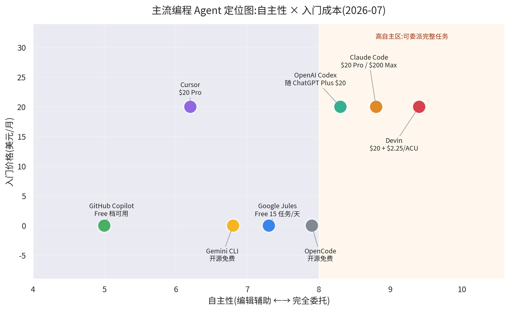
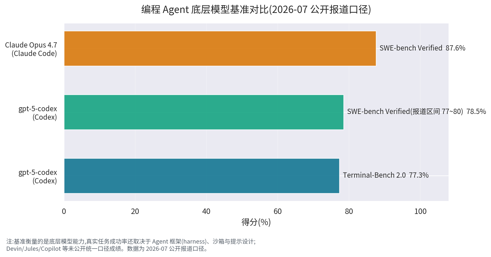
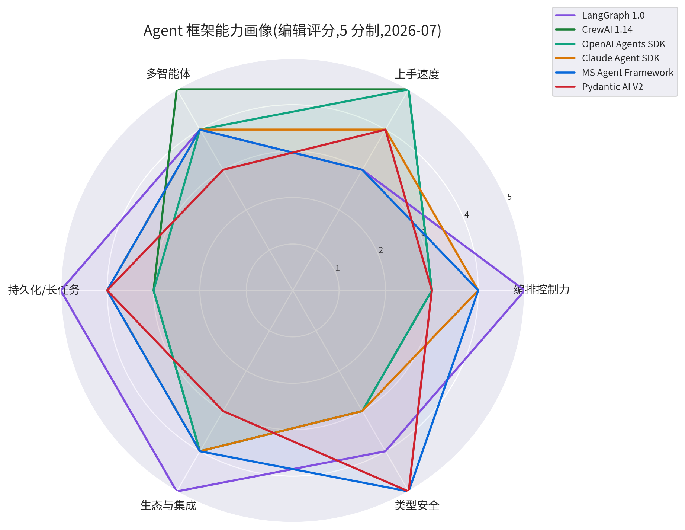

# 12 - 主流 Agent 对比分析(Mainstream Agent Landscape 2026)

> **本章定位:** 前面 11 章讲的是"Agent 怎么造"——原理、协议、编排、记忆、部署、评估;本章讲的是"Agent 怎么选"——2026 年年中市场上真实存在的产品、框架与平台,各自适合谁、多少钱、有什么坑。
>
> **与 03 章的分工:** 03 章《智能体主体》讲概念与框架原理(Agent Loop、ReAct、Multi-Agent、Sub-agent 是什么、为什么);本章讲市场格局与选型决策(Claude Code 和 Codex 选哪个、LangGraph 和 CrewAI 怎么搭、企业平台什么时候上)。03 章回答"它是什么",本章回答"我该买/用哪个"。
>
> **阅读建议:** 赶时间直接看第七节《选型指南》;想系统理解格局按顺序读;只关心编程工具读第二节即可(本章一半篇幅在那里——因为编程是 2026 年 Agent 落地最成熟的赛道)。

> **📏 数据口径声明(必读):**
>
> - 本章事实与数字的口径为 **2026-07 公开资料**(官方文档、官方定价页、公开评测与报道)。
> - AI Agent 市场的**价格、档位、功能、模型版本变动极快**(有的产品一年内调价数次),所有价格与功能细节**以各官网当前页面为准**。
> - 基准分数(SWE-bench 等)为公开报道口径,不同 harness(框架/沙箱/提示)下结果不可直接横比,详见 2.10 节。
> - 文中的"自主性评分""能力雷达评分"等为**编辑判断**(主观评估,用于辅助理解相对位置),非官方数据。
> - 本章为个人学习笔记,不构成采购建议;如有错误欢迎指正。

**本章结构地图:**

| 节 | 内容 | 回答的问题 | 篇幅 |
|----|------|-----------|------|
| 一 | 市场四层全景 | "Agent 市场到底有哪些东西?" | 短 |
| 二 | 编程 Agent 产品对比 | "写代码该买哪个?" | ★ 长(核心) |
| 三 | 通用 Agent 产品 | "办杂事该用哪个?" | 短 |
| 四 | Agent 开发框架 | "自建该用哪个框架?" | 中 |
| 五 | 企业托管平台 | "公司级治理选哪家?" | 短 |
| 六 | 格局演变 2024→2026 | "这市场怎么长成这样的?" | 短 |
| 七 | 选型指南 | "所以我到底选哪个?" | 中 |
| 八 | 上手建议 + 参考来源 | "第一步做什么?" | 短 |

---

## 📚 本章专业词汇速查表

> 阅读本章前必看。更完整的概念解释见对应章节(02 协议 / 03 主体 / 04 能力约束 / 05 编排 / 11 评估)。

| 序号 | 术语 | 英文 | 一句话解释 |
|------|------|------|-----------|
| 1 | **编程智能体** | Coding Agent | 能读写代码库、跑命令、自主完成编程任务的 Agent 产品 |
| 2 | **后台智能体** | Background Agent | 在云端/后台异步执行任务的 Agent,不占用你的前台会话 |
| 3 | **SWE-bench** | SWE-bench (Verified) | 用真实 GitHub Issue 修复衡量编程能力的权威基准,Verified 为人工筛选子集 |
| 4 | **终端基准** | Terminal-Bench | 衡量 Agent 在终端环境完成真实命令行任务能力的基准 |
| 5 | **执行外壳** | Harness | 包裹模型的执行外壳:工具循环、沙箱、提示词、权限——同模型不同 harness 表现差距巨大 |
| 6 | **代理计算单元** | ACU (Agent Compute Unit) | Devin 的用量计费单位,按 Agent 实际消耗的计算资源计费 |
| 7 | **自带密钥** | BYOK (Bring Your Own Key) | 工具本身免费/低价,模型调用走你自己的 API Key 付费 |
| 8 | **持久化执行** | Durable Execution | 工作流状态落盘(checkpoint),进程崩溃后可从断点续跑 |
| 9 | **人在回路** | HITL (Human-In-The-Loop) | 关键步骤暂停等人确认的协作模式 |
| 10 | **任务移交** | Handoff | 一个 Agent 把任务转交给更合适的 Agent 的机制 |
| 11 | **子智能体** | Sub-agent | 主 Agent 派生的、运行在独立上下文中的专用 Agent |
| 12 | **智能体名片** | Agent Card | A2A 协议中描述 Agent 能力与入口的 JSON 元数据 |
| 13 | **模型上下文协议** | MCP (Model Context Protocol) | Anthropic 2024-11 开源的 Agent↔工具接入标准,已成事实标准 |
| 14 | **智能体间协议** | A2A (Agent2Agent) | Google 发起、2026 年捐入 Linux Foundation 的 Agent↔Agent 协议 |
| 15 | **智能体客户端协议** | ACP (Agent Client Protocol) | 客户端(IDE)与各类 Agent 进程通信的协议,用于并排调度多个 Agent |
| 16 | **沙箱** | Sandbox | 隔离的代码执行环境(容器/VM/系统级),限制 Agent 能碰什么 |
| 17 | **审批策略** | Approval Policy | 规定 Agent 执行命令前何时需要人批准的规则(Codex 为代表) |
| 18 | **权限模式** | Permission Mode | Claude Code 的 default/acceptEdits/plan/bypassPermissions 四级行为边界 |
| 19 | **规则文件** | CLAUDE.md / AGENTS.md | 放在仓库里、Agent 启动时自动加载的项目约定文件 |
| 20 | **git 工作树** | Git Worktree | 同一仓库的多个并行检出,让多个 Agent 互不干扰地同时干活 |

---

## 一、全景:2026 年的 Agent 市场分四层

### 1.1 四层结构总览

2026 年年中,"Agent"这个词在市场上至少指四种完全不同的东西。选型的第一步不是比产品,而是**先搞清楚自己在哪一层**:

```
┌──────────────────────────────────────────────────────────────────────────┐
│                    2026 年 AI Agent 市场四层全景                          │
│                                                                          │
│  第 1 层  编程 Agent 产品(买成品,改代码)                                │
│  ┌──────────────────────────────────────────────────────────────────┐    │
│  │ Claude Code · OpenAI Codex · Cursor · GitHub Copilot ·           │    │
│  │ Devin · Jules · Gemini CLI · OpenCode/Aider/Cline(开源)         │    │
│  │ ── 成熟度最高、付费意愿最强、竞争最惨烈 ──► 本章第二节             │    │
│  └──────────────────────────────────────────────────────────────────┘    │
│                                                                          │
│  第 2 层  通用 Agent 产品(买成品,办杂事)                                │
│  ┌──────────────────────────────────────────────────────────────────┐    │
│  │ ChatGPT Agent · Manus · Kimi · Genspark …                        │    │
│  │ ── 浏览器/办公/研究向,成果难自动验证 ──► 本章第三节                │    │
│  └──────────────────────────────────────────────────────────────────┘    │
│                                                                          │
│  第 3 层  Agent 开发框架(买零件,自己造)                                 │
│  ┌──────────────────────────────────────────────────────────────────┐    │
│  │ LangGraph · CrewAI · OpenAI Agents SDK · Claude Agent SDK ·      │    │
│  │ Google ADK · MS Agent Framework · Pydantic AI · LlamaIndex …     │    │
│  │ ── 给要自建 Agent 的开发者 ──► 本章第四节                          │    │
│  └──────────────────────────────────────────────────────────────────┘    │
│                                                                          │
│  第 4 层  企业托管平台(买地基,全公司用)                                 │
│  ┌──────────────────────────────────────────────────────────────────┐    │
│  │ Copilot Studio · Bedrock AgentCore · Vertex AI Agent Builder ·   │    │
│  │ AgentKit · Agentforce · watsonx Orchestrate · UiPath …           │    │
│  │ ── 治理/托管/采购友好 ──► 本章第五节                               │    │
│  └──────────────────────────────────────────────────────────────────┘    │
│                                                                          │
│   底层公共件:模型(GPT/Claude/Gemini…)+ 协议(MCP/A2A/ACP)               │
│   ── 见本书 09 章与 02 章                                                │
└──────────────────────────────────────────────────────────────────────────┘
```

### 1.2 与本书章节的映射

| 市场层 | 本质 | 对应本书章节 | 本章位置 |
|--------|------|-------------|---------|
| 第 1 层 编程 Agent 产品 | 成品工具,入口形态见 01 章 | 01 交互入口(CLI/IDE/Copilot 形态) | 第二节 |
| 第 2 层 通用 Agent 产品 | 成品工具,浏览器/办公向 | 01 交互入口 + 03 智能体主体 | 第三节 |
| 第 3 层 Agent 开发框架 | 库与 SDK,自建用 | 03 智能体主体 + 05 任务流程编排 | 第四节 |
| 第 4 层 企业托管平台 | 托管运行时 + 治理 | 10 部署网关运维 + 11 安全对齐评估 | 第五节 |
| 公共件:协议 | MCP / A2A / ACP | 02 智能体通信协议 | 第六节顺带梳理 |
| 公共件:评估 | SWE-bench / Terminal-Bench | 11 安全对齐评估 | 2.10 节 |

> **一句话记住:** 层与层之间不是替代关系而是堆叠关系——企业平台里跑的 Agent 可能是用框架写的,框架写的 Agent 可能通过 MCP 调编程 Agent 暴露的工具。大型组织常常四层同时存在。

### 1.3 各层成熟度与采购形态(编辑判断)

| 层 | 成熟度(2026-07) | 采购形态 | 决策人 |
|----|----------------|---------|--------|
| 编程 Agent 产品 | ★★★★★(最成熟) | 个人订阅 $0~$200/月 | 开发者自己 |
| 通用 Agent 产品 | ★★★☆ | 个人订阅为主 | 个人/小团队 |
| 开发框架 | ★★★★(1.0 扎堆) | 开源免费 + 模型 API 费 | 技术负责人 |
| 企业托管平台 | ★★★☆ | 企业合同,商务谈判 | CIO/采购/合规 |

> 启示:个人能直接决策的只有前两层加第三层(开源);第四层是组织行为,本章只给地图,不给采购建议。

---

## 二、编程 Agent 产品对比(本章核心)

> 编程(Coding)是 2026 年 Agent 商业化最成功的领域,没有之一。原因很直白:代码有测试可以自动验证成果、开发者付费意愿强、任务边界清晰。这一节占本章约一半篇幅。

### 2.1 定位图:自主性 × 入门成本



**怎么读这张图:**

- **横轴是自主性**(编辑判断):左边是"辅助你写"(补全、对话式编辑),右边是"把任务整个交给它"(派一个 issue,它自己跑完开 PR)。
- **纵轴是入门价格**(2026-07 官网口径的月付起步价):$0 一档是免费可用的开源/免费档,$20 一档是**个人开发者的甜点价位**——2026 年主流厂商不约而同把个人档定在 $20/月上下(Claude Pro、ChatGPT Plus、Cursor Pro、Jules Pro $19.99、Devin 入门 $20),这不是巧合,而是市场对个人开发者心理价位的共识。
- **右上"高自主区"**(橙色区):Claude Code、Codex、Devin 都在这一带——可以把完整任务委派出去。注意 Devin 自主性最高但它的真实成本是 "$20 + 按 ACU 用量",修一个 bug 第三方实测约 $5,重度使用远不止 $20。
- **免费档并不弱**:Jules Free(15 任务/天)、Gemini CLI、OpenCode 覆盖了"零预算也要用 Agent"的需求,其中 Jules 的免费档被普遍认为是全品类最慷慨的。

### 2.2 总对比表

> 价格为 2026-07 官网入门档口径;"自主性"为编辑判断(★越多越能完全委托);变动频繁,以官网为准。

| 产品 | 厂商 | 入口形态 | 底层模型 | 入门价格 | 自主性 | 云端后台 | 开源 | 一句话定位 |
|------|------|---------|---------|---------|--------|---------|------|-----------|
| **Claude Code** | Anthropic | 终端优先 + IDE/桌面/浏览器扩展 | Claude Opus 4.7 | $20 Pro | ★★★★★ | ✅ 远程模式 | ❌ | 终端里最像"靠谱同事"的 Agent |
| **OpenAI Codex** | OpenAI | CLI + Cloud + IDE 扩展 | gpt-5-codex | $20(随 ChatGPT Plus) | ★★★★★ | ✅ Codex Cloud | ❌ | 审批/沙箱模型最工整的全栈选手 |
| **Cursor** | Anysphere | AI 原生 IDE(编辑器+CLI+Web+移动+云) | 多模型可选(GPT/Claude 等) | $20 Pro | ★★★☆ | ✅ 后台 agents(≤8 并行) | ❌ | 日常高频编辑体验最好的 AI IDE |
| **GitHub Copilot** | GitHub/微软 | 入口最广:IDE/GitHub.com/CLI/移动/云 | GPT/Claude(按档位) | $0 Free / $10 Pro | ★★★★ | ✅ coding agent | ❌ | 企业治理摩擦最低的"默认选项" |
| **Devin / Devin Desktop** | Cognition | 云 VM 沙箱 + 桌面 IDE 指挥中心 | 自研 SWE-1.6 等 | $20 + $2.25/ACU | ★★★★★ | ✅ 原生云 VM | ❌ | 异步工单式"AI 外包工程师" |
| **Google Jules** | Google | Web 异步云端 agent | Gemini | $0 Free(15 任务/天) | ★★★★ | ✅ 原生云 VM | ❌ | 免费档最强的异步 PR 机器人 |
| **Gemini CLI** | Google | 终端 | Gemini | $0(个人免费额度) | ★★★★ | ❌ | ✅ | 开源免费的终端主力 |
| **OpenCode/Aider/Cline 等** | 社区 | 终端 / VS Code | BYOK 任选 | $0(+API 费) | ★★★☆ | ❌ | ✅ | 无锁定、模型自由的开源阵营 |

**入口形态 × 使用姿势交叉表(辅助理解上表):**

| 使用姿势 | 代表产品 | 人机关系 | 典型任务粒度 |
|---------|---------|---------|-------------|
| **结对编辑**(你写它补) | Cursor、Copilot 补全 | 你主导,它加速 | 几秒~几分钟的小步修改 |
| **对话式委托**(它做你审) | Claude Code、Codex CLI、Cline | 它执行,逐步请示 | 几十分钟的功能/修复 |
| **异步派单**(派活收 PR) | Jules、Devin、Codex Cloud、Copilot coding agent | 你下工单,它独立完成 | 几小时的完整 issue |
| **批量流水线**(多 agent 并行) | Devin Desktop(ACP 调度)、Cursor 后台 agents | 你当"包工头"评审 | 多单并行的工单池 |

> 四种姿势层层递进:越往右下,你越像"技术经理"而非"程序员"——这也是 2026 年开发者角色转变的缩影。

### 2.3 Claude Code(Anthropic)

**一句话定位:** 终端(terminal)优先的编程 Agent,2026 年"难题啃得动"的标杆,生态玩法的定义者。

**形态与入口:**

- **主入口是 CLI**:在终端里 `claude` 启动,贴着开发者的工作流(ssh、tmux、CI 都友好)。
- 同时提供 **IDE 扩展**(VS Code / JetBrains)、**桌面应用**与**浏览器扩展**,终端党与 GUI 党都能用。
- **远程模式(云端)+ 定时任务**:可以把任务丢到云端跑,也可以让它定时执行(如每晚巡检)。

**模型与性能:**

- 底层模型 **Claude Opus 4.7**,**SWE-bench Verified 87.6%**(2026-07 公开报道口径),当前该基准的领先者。
- 长程任务稳定性、大代码库导航是社区口碑最好的两项。

**价格(2026-07 口径):**

| 档位 | 价格 | 说明 |
|------|------|------|
| Pro | $20/月 | 个人开发者甜点档,日常够用 |
| Max | $200/月 | 约 20 倍用量,重度/全职 Agent 用户 |

> 以官网当前页面为准;超量也可走 API 按量付费。

**权限与安全(权限模式四档):**

| 模式 | 行为 |
|------|------|
| `default` | 写文件/跑命令前逐个询问 |
| `acceptEdits` | 自动接受文件编辑,命令仍需确认 |
| `plan` | 只规划不动手,先出方案给你审 |
| `bypassPermissions` | 全自动(建议仅在容器/沙箱里用) |

**生态与扩展(Claude Code 最深的护城河):**

- **CLAUDE.md**:仓库级规则文件,启动自动加载(见本书 04 章)。
- **Hooks**:工具调用前后挂确定性脚本(如保存即 lint)。
- **Skills**:可复用的能力包,社区生态活跃。
- **内置 3 个 Subagent**:Explore(代码库探索)、Plan(方案规划)、general-purpose(通用杂务),主 Agent 自动委派。
- **MCP**:作为 MCP 的发起方,工具接入最全。
- **Claude Agent SDK**:与 Claude Code 同源的库——你可以用代码构建和 Claude Code 同架构的自有 Agent(见 4.3 节)。

**典型工作流(终端为例):**

```
$ claude                      # 进入交互会话
> /init                       # 扫描仓库,生成 CLAUDE.md 草稿
> 帮我给订单模块加退款接口      # 派任务
   ├─ Explore subagent 先扫代码库,找相关文件
   ├─ Plan 出方案 → 你确认
   ├─ 编辑代码(acceptEdits 下自动落盘)
   └─ 跑测试 → 绿了 → 汇报 diff
> /hooks 配置保存后自动 lint   # 把纪律固化下来
```

**适合谁:** 终端原住民;常啃大型遗留库、复杂重构、多步骤难题的人;想要"工具+生态"可编程性的团队。

**常见坑:**

1. 重度使用很快撞到 Pro 档用量墙,要有升 Max 或走 API 的预算预期;
2. `bypassPermissions` 裸奔在宿主机上是事故温床,务必配合容器;
3. Hooks/Skills 配得太复杂会反噬可维护性——先从 CLAUDE.md 做起。

### 2.4 OpenAI Codex

**一句话定位:** OpenAI 的编程 Agent 家族(CLI + Cloud + IDE 扩展),安全模型(审批 × 沙箱)设计最工整,终端基准的领先者。

**形态与入口:**

- **Codex CLI**:终端交互式 Agent;`codex exec` 提供**非交互模式**,适合脚本化与 CI 流水线。
- **Codex Cloud**:云端后台执行,任务异步跑在云沙箱里。
- **IDE 扩展**:VS Code 等编辑器内使用。

**模型与性能:**

- 底层模型 **gpt-5-codex**。
- **SWE-bench Verified 约 77~80%**(公开报道区间),**Terminal-Bench 2.0 77.3%**——后者为当前领先,反映其终端任务能力的调教侧重。
- 详细的"怎么读基准"见 2.10 节。

**价格(2026-07 口径):** 随 ChatGPT 订阅——**Plus $20/月** 可用,**Pro $200/月** 更高用量。对个人而言等于"买 ChatGPT 送编程 Agent",组合性价比高。以官网为准。

**权限与安全(双旋钮设计,业界样板):**

| 旋钮 | 取值 | 含义 |
|------|------|------|
| `approval_policy` | `untrusted` | 默认不信任,凡事都问 |
| | `on-failure` | 先跑,失败再问 |
| | `on-request` | Agent 自己判断何时请求批准 |
| | `never` | 全自动(配严格沙箱使用) |
| `sandbox_mode` | 读/写范围分级 | 控制文件系统与网络可见范围 |

**审批组合推荐(编辑建议):**

| 场景 | 推荐组合 |
|------|---------|
| 生产仓库、重要分支 | `on-request` + 写权限仅限工作区 |
| 个人玩具项目 | `on-failure` + 默认沙箱 |
| CI/脚本批量任务 | `never` + 严格沙箱(容器内、无网络或白名单) |
| 学习/观察 Agent 行为 | `untrusted`,看它每一步想干什么 |

**生态与扩展:**

- **AGENTS.md**:仓库级规则文件的跨工具开放标准(60k+ 项目采用,见 04 章),Codex 是其主要推动者。
- **MCP 支持**:支持接入 MCP 工具,自身也可作为 `codex mcp-server` 暴露给其他客户端。
- 与 ChatGPT 账号体系打通,登录即用。

**适合谁:** 已有 ChatGPT 订阅的人;需要把 Agent 嵌进脚本/CI 的工程团队;看重审批流与沙箱边界的谨慎派。

**常见坑:**

1. 三入口(CLI/Cloud/IDE)能力有细微差异,同一个任务换个入口表现可能不同;
2. `approval_policy=never` + 宽沙箱 = 风险自负,生产仓库慎用;
3. 用量与 ChatGPT 订阅共享,重度跑云端任务时注意额度。

### 2.5 Cursor(Anysphere)

**一句话定位:** AI 原生 IDE 的头部产品,"人在环中、高频编辑"场景体验最好的选手,正在从编辑器长成多入口 Agent 平台。

**形态与入口:**

- 本体是**编辑器**(VS Code 兼容的 fork),Tab 补全与内联编辑是招牌;
- 已扩展出 **CLI、Web、移动端与云端 agents**——不再只是 IDE;
- **后台 agents(Background Agents)** 最多 **8 个并行**,任务丢到云端跑。

**模型与性能:**

- **多模型可选**(GPT、Claude 等),基准随所选模型浮动——Cursor 本身不绑定单一模型,选 Opus 4.7 就接近 Claude Code 的模型上限,选便宜模型就省钱降智。
- 强项不是单次委托的极限能力,而是**日常编辑的流畅度**:补全、重写、小步快跑的迭代。

**价格(2026-07 口径,额度制):**

| 档位 | 价格 | 说明 |
|------|------|------|
| Pro | $20/月 | 个人档,含一定额度 |
| Pro+ | $60/月 | 更高额度 |
| Ultra | $200/月 | 重度档 |

> 额度(credit)制:不同模型烧额度速度不同,选贵模型要盯着用量。以官网为准。

**额度使用的三条实用经验(编辑建议):**

1. **日常编辑挂便宜模型,难题手动切贵模型**——把贵模型当"专家号"而不是默认门诊;
2. **后台 agents 是烧额度大户**,并行 8 个任务前先看剩余额度;
3. **额度见底前的降级方案**:切到自带 API Key(若支持)或临时用开源插件(Cline 等)过渡,避免工作流中断。

**权限与安全:** 编辑器内逐 diff 确认的工作流天然人在环中;后台 agents 在云沙箱执行;企业版提供隐私与合规选项(以官网为准)。

**生态与扩展:**

- 2026 年**收购了 Continue**(开源 IDE 自动补全/agent 项目),补开源生态与自定义能力;
- 支持 MCP;规则文件(`.cursor/rules`)体系成熟;
- 插件生态继承 VS Code 大部。

**适合谁:** 以 IDE 为主战场的开发者;日常高频编辑 + 中等复杂度任务;想在一个工具里兼顾"手写"与"委派"的人。

**常见坑:**

1. 额度制下选错模型(长期挂贵模型)会月初就烧完额度;
2. 大重构时后台 agents 并行虽爽,但 8 个任务同时改一个仓库,合并冲突与评审压力会转移到你身上;
3. 它是 fork 版 VS Code,部分上游新特性与插件兼容性略有滞后。

### 2.6 GitHub Copilot

**一句话定位:** 入口分布最广、企业治理摩擦最低的"默认选项"——未必是单点最强,但你在哪它就在哪。

**形态与入口(全品类最广):**

IDE(VS Code / JetBrains / Visual Studio / Xcode 等)、**GitHub.com 网页**、**CLI**、**移动端**、**云端 coding agent**、**代码评审(Code Review)**——六大入口。

**模型与性能:**

- 模型按档位提供 GPT / Claude 等选择,能力随所选模型;
- 标志性工作流:**coding agent 原生支持"分配 issue → 自动开 PR"**——把 issue assign 给 Copilot,它在自己的云环境里改代码、跑测试、提交 PR 等你评审。

**价格(2026-07 口径):**

| 档位 | 价格 | 说明 |
|------|------|------|
| Free | $0 | 每月 50 次高级请求,够体验 |
| Pro | $10/月 | 个人档,全品类最便宜的付费档 |
| Enterprise | $39/用户/月 | 企业治理、策略管控 |

> 以官网为准。

**Copilot 的"隐性优势"(为什么大组织常常默认选它):**

1. **采购摩擦最低**:很多公司已有 GitHub Enterprise 合同,加购 Copilot 只是加一个 SKU;
2. **安全评审容易过**:代码数据流在 GitHub/微软体系内,合规团队熟悉;
3. **渐进式采纳**:可以只开补全 → 再开对话 → 再开 coding agent,按团队接受度分层推进;
4. **无感化**:不强制改变任何现有工作流,这是它比"更激进但更强"的对手更适合大规模铺开的根本原因。

**权限与安全(企业治理是其王牌):**

- 与 **GitHub 权限体系、分支保护(branch protection)、Actions** 深度联动:Copilot 开的 PR 走和人一样的评审与 CI 门禁;
- 企业版可集中管理策略、审计用量,对合规团队是最低摩擦的选择。

**生态与扩展:** 坐拥 GitHub 平台本身:Issues、PR、Actions、Code Review、组织权限——别家要集成的,它原生就是。支持 MCP。

**适合谁:** 已经深度用 GitHub 的团队;需要集中管控、审计、合规的企业;想要"润物细无声"式辅助而非激进委派的组织。

**常见坑:**

1. Free 档 50 次高级请求对重度用户只是试用装;
2. "全能入口"的另一面是单个入口的深度未必拼得过专精选手(如终端深度不及 Claude Code);
3. 自动 PR 质量依赖仓库自身的测试/CI 完备度——没测试的仓库它也会自信地开烂 PR。

### 2.7 Devin / Devin Desktop(Cognition)

**一句话定位:** "AI 外包工程师"的鼻祖,2026 年降价商品化后与 Windsurf 合并为"IDE + 多 Agent 指挥中心",走异步工单式路线。

**形态与入口(2026 年大改版):**

- **Devin(云端)**:每个任务跑在**完整 VM 沙箱**里——自带 IDE、浏览器、终端,你可以实时围观它干活;
- **Devin Desktop**:Windsurf 并入后的新形态——完整 IDE + **多 Agent 指挥中心**,通过 **ACP(Agent Client Protocol)** 并排调度 Devin Cloud、Codex、Claude Code 等多个 Agent,像任务看板一样管理;
- **Spaces**:多个 Agent 共享 git worktree 并行工作而互不踩踏。

**模型与性能:**

- 自研 **SWE-1.6** 模型,各档**无限量**使用(用量费体现在 ACU 上而非模型 token 上);
- 也可以通过 ACP 调度别家 Agent(用别家模型),定位从"一个 Agent"转向"Agent 的调度台"。

**价格(2026-07 口径,2026-04 大降价后):**

| 项目 | 价格 | 说明 |
|------|------|------|
| 入门 | $20/月起 | 原价曾高达 $500/月,2026-04 降至 $20 起 |
| 用量 | $2.25/ACU | 按 Agent 计算单元用量计费;第三方实测修一个 bug 约 $5 |

> 这是"低门槛 + 用量计费"模式:轻度试用很便宜,重度委派要盯 ACU 账单。以官网为准。

**ACU 成本估算示例(按第三方实测 $5/bug 类推):**

| 使用强度 | 工单量假设 | 月用量成本估算 | 对比座席价 |
|---------|-----------|---------------|-----------|
| 轻度(试用) | 20 单/月 | 约 $100 + $20 订阅 | 低于一个 $200 档订阅 |
| 中度(小组日常) | 100 单/月 | 约 $500 + 订阅 | 接近 1 个初级外包的人力零头 |
| 重度(流水线) | 500 单/月 | 约 $2,500 + 订阅 | 需与自建/嫡系工具总成本对比 |

> 注意:单工单成本随任务复杂度大幅波动,上表只是量级感;真实预算前先用 10 个自家工单实测单价。

**权限与安全:** 全 VM 隔离天然是最强沙箱形态之一;每个任务独立环境,权限边界清晰;企业功能(审计、SSO 等)以官网为准。

**生态与扩展:** ACP 调度多家 Agent 是最大差异化;Windsurf 带来的 IDE 用户基础;支持常见 IDE/团队协作入口(以官网为准)。

**适合谁:** 想把"修 bug、小需求"整单外包出去的团队;需要多 Agent 并行流水线(派 10 个工单同时跑)的组织;愿意按效果付费而不是买断座席的团队。

**常见坑:**

1. **ACU 用量计费不可小觑**:一个 bug $5 看似便宜,一天派 20 单就是 $100,预算要按工单量估算;
2. 完全委派对任务描述质量要求高——烂工单进,烂 PR 出;
3. 并购整合期(Windsurf → Devin Desktop)产品形态变动快,工作流别太依赖过渡形态的细节。

### 2.8 Google Jules(及 Gemini CLI / Antigravity)

**一句话定位:** Google 的异步云端编程 Agent——给它仓库和任务,它在云 VM 里干完活开 PR,免费档是全品类最慷慨的。

**形态与入口:**

- **纯异步云端**:选择 GitHub 仓库 → 描述任务 → 云 VM 执行 → 自动开 PR;
- 带 **CI 修复闭环**:PR 的 CI 挂了它会继续修,直到绿为止;
- 不是给你"结对"的,是给你"派活"的。

**一个工单的生命周期:**

```
你:选仓库 + 写任务描述("把 lodash 升到最新并修复 breaking changes")
  │
  ▼
Jules:克隆到云 VM → 读代码 → 出执行计划(可审)
  │
  ▼
Jules:改代码 → 跑测试 → 提交分支 → 开 PR
  │
  ▼
CI:红了?→ Jules 自动读取失败日志 → 继续修 → 推新 commit
  │
  ▼
你:评审 PR(diff + CI 全绿)→ 合并或打回
```

**模型与性能:** Gemini 系列模型;**基准透明度低**(官方较少公布统一口径的 SWE-bench 成绩),真实能力建议以免费档实测为准。

**价格(2026-07 口径):**

| 档位 | 价格 | 说明 |
|------|------|------|
| Free | $0 | **15 任务/天、3 并发**——品类最佳免费档 |
| Pro | $19.99/月 | 更高任务量与并发 |
| Ultra | $124.99/月 | 重度档 |

> 以官网为准。

**权限与安全:** 任务在 Google 云 VM 中隔离执行;改动以 PR 形式交付,合并前可完整评审,风险边界清晰。

**生态与扩展:** 与 GitHub 工作流深度绑定(仓库、PR、CI);Google 账号体系;同生态还有两兄弟:

| 产品 | 定位 | 要点 |
|------|------|------|
| **Gemini CLI** | 开源终端 agent | 代码开源、支持 MCP、个人有免费额度,是零预算终端路线的首选之一 |
| **Antigravity** | Agent 优先的 IDE | 协调编辑器/终端/浏览器/云的"多面体"IDE,Agent 是一等公民而非插件 |

**适合谁:** 零预算个人(Free 档 15 任务/天足够日常);批量小工单(依赖升级、样板修改、简单 bug 修复);Google 生态用户。

**常见坑:**

1. 基准透明度低意味着要自己拿真实任务试水,别凭宣传预期;
2. 异步队列在高峰时段可能排队,急活别指望它;
3. 深度复杂任务(大重构)的完成度与头部终端 Agent 有差距(编辑判断,建议实测)。

### 2.9 开源阵营与其他商业选手

**开源阵营(对比小表):**

| 产品 | 形态 | 模型 | 特色 | 一句话 |
|------|------|------|------|--------|
| **OpenCode** | 终端 | 灵活任选 | 免费、无锁定 | 终端开源 Agent 的热门选择 |
| **Aider** | 终端 CLI | BYOK | git 友好的结对编程,提交历史干净 | 老牌开源结对工具 |
| **Cline / Roo Code / Kilo Code** | VS Code 插件 | BYOK | 编辑器内 agent,自带密钥成本可控 | IDE 里的开源 agent 三剑客 |
| **OpenHands** | 平台/SDK | 多模型 | 面向研究与自建的开源 agent 平台 | 学术界与二次开发常用 |
| **Qwen Code** | 终端 | Qwen 系列 | 阿里 Qwen 生态 | 中文社区友好 |
| **Kimi Code** | 终端 | Kimi | 长上下文见长 | 长文件/长会话场景有优势 |

> 开源阵营共同优势:**BYOK 无锁定**、可审计、可二次开发;共同代价:模型费用自担、工程稳定性与官方支持弱于商业产品。

**开源工具怎么选(编辑判断):**

1. 想要终端里"最像 Claude Code"的开源体验 → 先试 **OpenCode**;
2. 重度 git 工作流、要求提交历史干净 → **Aider**;
3. 不想离开 VS Code → **Cline**(或其衍生 Roo Code / Kilo Code,功能侧重略有差异);
4. 做 Agent 研究、二次开发 → **OpenHands**;
5. 中文场景 / 国产模型生态 → **Qwen Code**、**Kimi Code**。

> **BYOK 成本提醒:** 开源免费的是工具,模型调用仍按 API 计费。重度使用顶级模型的月账单完全可能超过 $20 订阅档——开源路线省的是"锁定风险",不一定是"钱"(见 FAQ Q4)。

**其他商业选手一席话:**

- **Amazon Q Developer**:与 AWS 深度绑定(IAM、S3、Lambda 等场景顺手),AWS 重度用户的首选补充;
- **Tabnine**:主打**隐私 / 私有化 / 气隙(air-gapped)部署**,代码不出内网的合规敏感行业方案;
- **Kiro**(AWS):主打**规范驱动开发(spec-driven development)**——先写规格再让 agent 实现,流程纪律性强;
- **Factory Droids**:面向**受监管行业**的 agent 平台,公开客户包括 NVIDIA、Adobe、Bayer 等。

### 2.10 基准对比与"怎么读基准"



**图上数据(2026-07 公开报道口径):**

| 模型(所属产品) | 基准 | 得分 |
|----------------|------|------|
| Claude Opus 4.7(Claude Code) | SWE-bench Verified | **87.6%**(当前领先) |
| gpt-5-codex(Codex) | SWE-bench Verified | 约 77~80%(报道区间) |
| gpt-5-codex(Codex) | Terminal-Bench 2.0 | **77.3%**(该基准领先) |

**怎么读基准(三条纪律):**

1. **基准衡量的是"底层模型 + 官方 harness"的组合**,不是产品在你仓库里的真实成功率。harness(工具循环、沙箱、提示词、检索策略)对结果的影响巨大——第三方实测中就出现过 **Cursor 后台 agent + Opus 4.7 在同任务上超过 Devin** 的案例,同一模型换个 harness 名次就会变。
2. **不同基准测不同能力**:SWE-bench 测"修真实 GitHub issue",Terminal-Bench 测"终端里完成真实命令行任务"。一个产品 SWE-bench 低不代表终端活儿差,Codex 就是 Terminal-Bench 更强的例子。
3. **看滚动数据,别看发布会数字**:推荐聚合站 **artificialanalysis.ai** 等持续更新的第三方榜单,它们用统一条件复测,比厂商自报数字更可比。另外注意基准污染与"刷榜"问题(见本书 11 章评估部分)。

**落地建议:做你自己的"微型基准"(自测清单)。** 选型的唯一金标准是自家任务实测:

1. 从真实工作中挑 **5~10 个代表性任务**(1 个简单 bug、1 个跨文件功能、1 个重构、1 个写测试、1 个读陌生代码答问题);
2. 同一批任务分别喂给候选工具,**盲评**产出(不看是哪个工具做的);
3. 记录三个数:**一次通过率**(不用返工的比例)、**人均介入次数**(你被叫回来救场几次)、**单任务成本**(额度/ACU/订阅折算);
4. 按"一次通过率 × 成本"排序,而不是按品牌排序。

> 这个清单同样适用于框架(第四节)与通用 Agent(第三节)的选型。

### 2.11 AI 编程 Agent ≠ AI 应用生成器

2026 年常被混淆的两类工具:

| 维度 | AI 编程 Agent(本节主角) | AI 应用生成器(App Builder) |
|------|------------------------|---------------------------|
| 代表 | Claude Code / Codex / Cursor / Devin | Lovable / Bolt.new / v0 / Replit Agent |
| 输入 | 真实存在的代码库 + 任务 | 一句自然语言需求描述 |
| 输出 | 对现有代码的修改(diff / PR) | 从零生成一个可运行的首版应用 |
| 强项 | 维护、演进、重构真实项目 | 快速出原型、出 demo、出 MVP |
| 短板 | 从零生成整应用不如生成器顺手 | 生成之后的长期维护是灾难(代码质量/结构差) |
| 典型用户 | 职业开发者 | 产品/运营/独立开发者/黑客松 |

> **常见组合:** 用应用生成器 1 小时出首版 → 导出代码库 → 交给编程 Agent 长期维护演进。两者是接力关系,不是竞争关系。

**接力工作流示意:**

```
Lovable/Bolt.new/v0            git 导出             Claude Code/Codex/Cursor
"一句话生成首版 MVP"    ──►   代码库入库    ──►   "作为真实工程持续演进"
(小时级,验证想法)                                  (月/年级,重构/测试/迭代)
        │                                                │
        └──── 别反过来用:让生成器维护老代码,或让          ──┘
              编程 Agent 从零憋出整应用,都事倍功半
```

---

## 三、通用 Agent 产品(General-Purpose Agents)

> 与编程 Agent 的分野:**工具面不同**(浏览器、办公软件、文件系统,而非代码库与终端),**验证方式不同**(研究成果没有"测试通过"这种硬标准,好坏要靠人判断)。因此这一层的成熟度整体落后于编程 Agent,更适合研究、整理、办公自动化类"软产出"任务。

### 3.1 对比表

| 产品 | 厂商 | 核心形态 | 强项 | 备注(2026-07 口径) |
|------|------|---------|------|---------------------|
| **ChatGPT Agent** | OpenAI | 统一 Agent 模式(浏览器/电脑操作) | 研究 + 操作一体,生态最广 | 2025-07 由 Operator(浏览器操作)与 Deep Research(深度研究)合并而来 |
| **Manus** | Monica | 通用任务 Agent(云 VM 执行) | 任务闭环交付(研究/分析/文档) | 2025-03 出圈,GAIA 基准曾引发广泛关注 |
| **Kimi** | Moonshot AI | 对话 + Agent 模式 | 长上下文处理(长文档/长会话) | 国内用户触达门槛低 |
| **Genspark** | Genspark | Agent 驱动的搜索/内容工作区 | 研究汇总与内容生产 | 主打"Sparkpage"式成果页 |

> 本表仅列代表性产品,该层新产品迭代极快,现状细节以官网为准。

### 3.2 逐个短评

**ChatGPT Agent(OpenAI)** — 2025-07 由 **Operator**(浏览器自主操作)与 **Deep Research**(多步骤深度研究)合并而成的统一 Agent 模式:一边能帮你"查"(几十上百个网页的汇总研究),一边能帮你"办"(在浏览器里点击、填表、操作),还拥有沙箱化的虚拟电脑环境。优势是生态与账号体系最成熟(Plus 订阅即可用);边界是操作类任务的失败率仍显著高于研究类,涉及支付、账号、对外发送的动作务必人工确认。以官网当前能力说明为准。

**Manus(Monica)** — 2025-03 出圈的"通用任务 Agent"代表:云端 VM 中自主执行,从任务拆解到成果交付(研究报告、数据分析、网页、文档)一条龙,发布时以 GAIA 基准成绩引发广泛关注。它的行业意义在于把"Agent 直接交付完整成果而非建议"的心智普及给了大众市场;后续版本与定价迭代较快,以官网为准。

**Kimi(Moonshot AI)** — 国内产品中**长上下文**心智最强的选手:长文档精读、长会话连续性是其传统强项,叠加 Agent 模式后可完成"读长文 → 查资料 → 产出报告"的复合任务。对中文用户而言触达门槛最低(网页/App 即用),适合长文档研究与中文办公场景。具体额度与功能以官网为准。

**Genspark** — 以 Agent 驱动的搜索/内容工作区见长,把搜索结果组织成结构化的成果页(Sparkpage),适合快速建立对陌生主题的第一认知。与其他几家的差异在于"成果的可读性与结构化";深度操作能力非其主打,以官网为准。

### 3.3 自托管个人 Agent:小龙虾与爱马仕(→ 详见 13 章)

2026 年上半年,通用 Agent 里长出了一个独立的爆款子品类——**自托管个人常驻 Agent**:跑在你自己的电脑/VPS 上、通过聊天软件指挥、7×24 小时待命的"私人 AI 管家"。两个代表:

| 产品 | 花名 | 一句话 | GitHub 热度(报道口径) |
|------|------|--------|----------------------|
| **OpenClaw** | 🦞 小龙虾 | 本地优先、白盒可控的"数字执行官"(TypeScript,MIT) | 约 28 万(2026-03 报道) |
| **Hermes Agent** | 🐎 爱马仕 | 会自我进化的私人 AI(学习循环自动沉淀 Skill,Python,MIT) | 6.6 万+(2026-04 报道) |

两者均为 MIT 开源、免费自部署,掀起过"养虾/养马"的社区热潮(甚至催生出代安装产业链)。**架构解读、正面对比、部署实战与安全风险,详见本书第 13 章《自托管个人 Agent:OpenClaw 与 Hermes Agent》。**

### 3.4 形态差异与选型要点

**与编程 Agent 的三个本质区别:**

```
编程 Agent                          通用 Agent
─────────────────────────────       ─────────────────────────────
工具面:代码库/终端/CI            vs  工具面:浏览器/文档/表格/邮件
验证:测试跑过 = 成功(硬指标)    vs  验证:人读完觉得好 = 成功(软指标)
成果:diff / PR(可评审可回滚)    vs  成果:报告/表格/网页(难自动校验)
```

**选型要点(编辑判断):**

1. **研究类任务**(行业调研、资料汇总):看"深度研究"能力的成色——ChatGPT Agent(Deep Research 血统)与 Manus 是典型代表;
2. **操作类任务**(填表、订流程、跨网页搬运):看浏览器/电脑操作的稳定性,这类任务失败率仍明显高于编程任务,**关键操作务必人在回路(HITL)确认**;
3. **长文档场景**(几百页 PDF、长合同):Kimi 等长上下文见长的产品更顺手;
4. **成果可信度**:通用 Agent 会"自信地编",引用与数字必须抽查——这与 11 章讲的幻觉问题是同一个根源。

> **保守提醒:** 本层产品营销话术普遍激进("全自动""解放双手"),实测成功率与宣传常有差距。建议用自家真实任务做小规模试点,再决定采购。

**附:通用与编程的边界正在融化。** 2026 年的一个明显趋势是两边互相渗透:编程 Agent 长出浏览器(查文档、验证网页),通用 Agent 长出代码解释器(数据分析、生成脚本)。分层的价值在于帮你认清**主战场**——一个工具的主战场决定它的优化方向与成功率分布,副业功能别当主力用。

---

## 四、Agent 开发框架对比(给要自建 Agent 的开发者)

> 当你不满足于现成产品、要把 Agent 嵌进自己的系统时,就来到这一层。框架选型对应本书 03 章(形态)与 05 章(编排)的原理,本节给市场现状。

### 4.1 总表

| 框架 | 语言 | 核心范式 | 强项 | 适合 | 2026 里程碑 |
|------|------|---------|------|------|-------------|
| **LangGraph 1.0** | Python + JS/TS | 图状态机,显式控制 | 持久化/长任务/可控性 | 不能挂的生产系统 | 2025-10 GA |
| **CrewAI 1.14** | Python | 角色制 crews + 事件驱动 flows | 上手最快 | 快速原型、多角色协作 | 2026-06 起记忆/RAG 后端可插拔 |
| **OpenAI Agents SDK** | Python(另有 JS) | Agents/Handoffs/Guardrails 三原语 | 轻量 + 内置 tracing | OpenAI 生态快速搭建 | 2026-04 "Next Evolution" 更新 |
| **Claude Agent SDK** | Python + TS | Claude Code harness 库化 | 与 Claude Code 同架构 | 想要"Claude Code 同款"行为 | 2026-06 起 subagent 支持 3 层嵌套 |
| **Google ADK** | Python 等 | workflow runtime + Task API | 多 agent 委派、Gemini 原生 | Google/Gemini 生态 | `adk web` 调试 UI 持续完善 |
| **MS Agent Framework 1.0** | .NET + Python 对等 | Semantic Kernel + AutoGen 合并继任 | 企业级、多模型、OTel | 微软栈企业 | 2026-04-03 GA |
| **Pydantic AI V2** | Python | harness-first + capability 原语 | 类型安全、工程洁癖友好 | 严谨工程团队 | 2026-06-23 发布 |
| **LlamaIndex Workflows 1.0** | Python + TS | 检索/索引一等公民 | RAG 型 agent | 知识库密集型应用 | 2026-06-22 发布 |

### 4.2 能力雷达图



> **评分说明:** 六个维度(编排控制力/上手速度/多智能体/持久化与长任务/生态与集成/类型安全)均为 **1~5 分的编辑判断**,用于表达相对画像,不是测评数据。读法举例:LangGraph 在"持久化/长任务"与"编排控制力"拉满但"上手速度"平庸;CrewAI 与 OpenAI Agents SDK 则是"上手速度"拉满的轻量派。

### 4.3 逐个点评

**LangGraph 1.0(LangChain)— 生产级编排的标杆**

- 核心:**图状态机**——节点是函数/LLM 调用,边是显式转移,控制流完全可见;
- **Durable Execution**:checkpoint 可存 Postgres 等后端,进程崩溃从断点续跑,长任务不掉链子;
- **HITL interrupt**:任意节点可暂停等人审批;**time-travel 调试**:回放任意历史状态;
- 生产用户:Uber、Klarna、LinkedIn、Replit、Elastic 等;
- 官方还提供 **DeepAgents**:opinionated 的开箱 harness,subagents、文件系统记忆、skills 预置好,省去自己搭架子。

**CrewAI 1.14 — 上手最快的角色制框架**

- 核心:**crews(角色制团队)+ flows(事件驱动流程)**:给 Agent 发角色(研究员/写手/审稿人),编排直觉、代码量少;
- 2026-06 起 **memory/knowledge/RAG 后端可插拔**,存储不被绑定;
- 适合:几小时搭出多角色协作原型;不适合一上来就要求高可靠的长任务生产场景(需自行补齐持久化)。

**OpenAI Agents SDK — 轻量三原语**

- 核心只有三个原语:**Agents / Handoffs / Guardrails**,加内置 **tracing** 与 **sessions**;
- 2026-04 有 "Next Evolution" 更新(能力持续扩展,细节以官方文档为准);
- 哲学:框架尽可能薄,把自由度留给开发者;适合 OpenAI 生态内快速搭建,换模型生态时迁移成本要另算。

**Claude Agent SDK — Claude Code 同款引擎**

- 原名 Claude Code SDK,即 **Claude Code 的 harness 库化**:hooks、进程内 MCP tools、skills、subagents 全套;
- 2026-06 起 **subagent 支持 3 层嵌套**(主→子→孙);
- 适合:认可 Claude Code 行为模式、想把它嵌进自己系统的团队;注意它与 Claude 模型生态的深度绑定。

**Google ADK — Gemini 原生的多 agent 委派**

- 核心:workflow runtime + **Task API**(多 agent 间委派任务的标准接口);
- Gemini 原生;自带 **`adk web` 调试 UI**,本地可视化调 agent 体验好;
- 与 Vertex AI Agent Builder(见第五节)是"框架-平台"组合。

**Microsoft Agent Framework 1.0(MAF)— 微软栈的大一统**

- 2026-04-03 GA,是 **Semantic Kernel 与 AutoGen 的官方合并继任者**(关系见 4.4 节);
- **.NET 与 Python 对等支持**(C# 团队的少数一等选择);
- **原生 MCP + A2A**;六家模型提供商开箱(Azure OpenAI / OpenAI / Anthropic / Bedrock / Gemini / Ollama);
- 内置 **OpenTelemetry(OTel)** 可观测性;与 **Azure AI Foundry** 深度集成;
- 适合:微软/Azure 栈企业,尤其是 .NET 技术栈。

**Pydantic AI V2 — 类型安全党的 harness-first**

- 2026-06-23 发布的 V2 是 **harness-first 重设计**;
- 核心概念 **capability 原语**:把 tools / instructions / hooks / 模型设置打包成可组合的单元;
- 官方 **Harness 包**:memory / guardrails / 沙箱代码执行开箱即用;
- **OTel 内置**;继承 Pydantic 的类型安全基因,工程洁癖友好。

**LlamaIndex Workflows 1.0 — RAG 型 Agent 首选**

- 2026-06-22 发布 1.0;检索与索引是**一等公民**(别家 RAG 是外挂,它是本命);
- Python + TS 双语言;
- 适合:知识库问答、文档密集型 Agent(与本书 08 章 RAG 体系天然衔接)。

**其他一席话:**

- **Strands Agents**(AWS):模型驱动 loop 的轻框架,AWS 生态顺手;
- **Mastra** 与 **Vercel AI SDK**:TypeScript 阵营主力,前端/全栈团队顺手;
- **Agno**:带 **AgentOS** 的自托管 agent 运行时,强调性能与自部署;
- **Smolagents**(HuggingFace):极简 **code-act** 路线(Agent 直接写代码当动作),教学与轻量任务友好。

**框架选型快查(按首要约束反查):**

| 你的首要约束 | 直接看 |
|-------------|--------|
| 生产不能挂(长任务/审批/崩溃续跑) | LangGraph 1.0、MS Agent Framework |
| 今天就要出 demo | CrewAI、OpenAI Agents SDK |
| 想要 Claude Code 同款行为 | Claude Agent SDK |
| 想要 OpenAI 生态 + 轻量 | OpenAI Agents SDK |
| Gemini / Google Cloud | Google ADK |
| .NET / C# 团队 | MS Agent Framework |
| 类型安全 + 工程洁癖 | Pydantic AI V2 |
| 知识库/RAG 密集型 | LlamaIndex Workflows |
| TypeScript 全栈 | Mastra、Vercel AI SDK |
| 纯学习原理 | Smolagents(代码量最小,易读) |

### 4.4 AutoGen 与 AG2 的关系(容易搞混,单独说清)

| 项目 | 归属 | 说明 |
|------|------|------|
| **AutoGen v0.2 API 时代** | 微软研究院 | 多 Agent 对话框架的最初形态 |
| **AG2** | 社区分支(ag2.ai) | 由部分原维护者分出的社区版,**延续 v0.2 API**,独立演进 |
| **AutoGen v0.4+** | 微软官方 | **完全重写**的版本,与 v0.2 API 不兼容 |
| **Microsoft Agent Framework** | 微软官方 | AutoGen 与 Semantic Kernel 的合并继任者,**新项目的官方推荐** |

> **实践建议:** 维护老 AutoGen v0.2 代码 → 评估 AG2;微软官方技术栈的新项目 → 直接用 Microsoft Agent Framework,别再新建 AutoGen 项目。

### 4.5 组合用法:业界的普遍实践

```
原型期(天级)                      生产期(不能挂)
─────────────────────             ─────────────────────────
CrewAI / Pydantic AI        ──►   LangGraph / MS Agent Framework
(快,先把流程跑通)                  (durable execution + HITL + OTel)
```

1. **两层策略:** 快框架(CrewAI/Pydantic AI)做原型验证逻辑;durable 框架(LangGraph/MAF)承载不能挂的生产任务;
2. **锁定成本在下降:** 主流框架都已支持 **MCP**,工具层(你写的 MCP servers)可以跨框架复用,迁移的主要成本在编排逻辑而非工具;
3. **模型层同理:** 通过 LiteLLM/网关抽象(见 10 章),多数框架可换底座模型,不必被单一供应商绑死。

**换框架时的迁移成本清单(从易到难):**

| 资产 | 可迁移性 | 说明 |
|------|---------|------|
| MCP 工具 servers | ★★★★★ 直接复用 | 协议标准,跨框架通用 |
| 提示词/指令 | ★★★★ 微调可用 | 注意各家模型的指令风格差异 |
| 评测集与测试用例 | ★★★★ 直接复用 | 与框架无关,务必积累 |
| 记忆/状态 schema | ★★★☆ 需要适配 | 各家存储抽象不同 |
| 编排逻辑(图/流程定义) | ★★☆ 基本重写 | 这是框架的核心差异所在 |

> 推论:**把投资放在可迁移资产上**(工具、评测、提示词),编排逻辑保持简单,换框架的痛感会小很多。

---

## 五、企业托管平台速览(Enterprise Agent Platforms)

> 第四层解决的不是"能不能造 Agent",而是"全公司几百个 Agent 怎么管":身份、权限、审计、计费、合规、SLA。

### 5.1 对比表

| 平台 | 厂商 | 绑定生态 | 核心卖点 | 适合 |
|------|------|---------|---------|------|
| **Copilot Studio + M365 Agents** | 微软 | M365 / Azure | 办公套件原生集成、企业治理 | 微软栈企业 |
| **Bedrock AgentCore** | AWS | AWS | 框架无关的托管运行时 + IAM 深度 | AWS 栈、自建框架的团队 |
| **Vertex AI Agent Builder** | Google | GCP | ADK + Gemini + BigQuery 数据面 | Google 栈、数据密集型 |
| **OpenAI AgentKit** | OpenAI | OpenAI | 从 SDK 到部署的一条龙 | OpenAI 生态团队 |
| **Agentforce 360** | Salesforce | Salesforce | CRM 数据与流程原生 | 销售/客服场景 |
| **ServiceNow AI Agents** | ServiceNow | ServiceNow | ITSM/工单流程原生 | IT 运维与服务管理 |
| **watsonx Orchestrate** | IBM | IBM Cloud | 受监管行业合规叙事 | 金融/政务等强合规 |
| **UiPath Agentic Automation** | UiPath | UiPath | RPA 存量客户升级 | 已有 RPA 资产的组织 |

> 以各官网 2026-07 页面为准;该层采购决策通常涉及商务谈判,标价仅供参考。

### 5.2 平台 vs 框架:不是二选一

| 维度 | 开发框架(第四节) | 托管平台(本节) |
|------|------------------|----------------|
| 本质 | 库 / SDK,代码的一部分 | 托管运行时 + 治理面 |
| 运维 | 你自己部署、监控、扩容 | 平台代管(程度因产品而异) |
| 采购 | 开源免费 + 模型 API 费用 | 企业合同、按座席/用量 |
| 治理 | 自己实现审计/权限 | 内置身份、审计、合规报表 |
| 锁定 | 代码层锁定(低-中) | 生态层锁定(中-高) |

> **大型组织的普遍形态是两者并用:** 用框架写核心 Agent(保留技术自主权),跑在托管平台上(获得治理与运维),通过 MCP 接入企业工具。例如:LangGraph 写的 Agent 部署到 Bedrock AgentCore;ADK 写的 Agent 发布到 Vertex AI Agent Builder。

### 5.3 平台选型要点(编辑判断)

1. **跟着现有生态走,别逆着来:** 全公司用 M365 就选 Copilot Studio,全云上 AWS 就看 Bedrock AgentCore——跨生态集成的隐性成本(身份打通、网络、审计格式)往往超过平台本身价差;
2. **先问治理,再问能力:** 企业采购的第一问题不是"能不能做",而是"出了事谁负责、日志在哪里、权限怎么收"——这正是平台层存在的意义;
3. **警惕"平台税":** 平台溢价买的是托管与合规,若团队本身有强 DevOps 能力且场景单一,自建(框架 + 10 章的部署栈)可能更省;
4. **保留退出通道:** 核心 Agent 逻辑用框架写、工具用 MCP 接,即使未来换平台,迁移的是部署而非重写。

---

## 六、格局演变:2024 → 2026

### 6.1 ASCII 时间线

```
2024
 ├─ 编程助手三级跳:自动补全 ──► 对话式编辑 ──► Agent 化(自主完成任务)
 └─ 年末:Anthropic 开源 MCP(2024-11),工具接入开始标准化
   │
2025
 ├─ 2025-03  Manus 出圈,"通用 Agent"进入大众视野
 ├─ 2025-07  ChatGPT Agent 发布(Operator + Deep Research 合并)
 ├─ 2025-10  LangGraph 1.0 GA,生产级编排框架成熟
 └─ 全年:后台云 agent 从新鲜事物变成各家标配
   │
2026
 ├─ 价格雪崩:Devin 从 $500/月降到 $20 起 + 用量计费 —— 后台 agent 商品化
 ├─ 自托管出圈:2026-01 OpenClaw(🦞 小龙虾)定名爆火,2026-02 Hermes Agent
 │              (🐎 爱马仕)开源两月揽 6 万+ star —— 个人常驻 Agent 成独立品类(见 13 章)
 ├─ 并购整合:Codeium ──► Windsurf ──► 并入 Cognition 成为 Devin Desktop
 │            Cursor 收购 Continue
 │            Gemini Code Assist 个人档 2026-06 停售(谷歌收敛产品线)
 ├─ 协议成型:A2A 1.0(2026)进入 Linux Foundation;MCP 成事实标准;
 │            ACP 让"一个客户端并排调度多个 Agent"成为现实
 └─ 框架收割:LangGraph 1.0 / MS Agent Framework 1.0 / Pydantic AI V2 /
              LlamaIndex Workflows 1.0 扎堆 GA,框架层进入"拼生产特性"阶段
```

### 6.2 三条主线解读

**主线一:后台云 Agent 商品化。** 2025 年"派任务给云端 agent 异步执行"还是高端功能(Devin $500/月),2026 年已是 $20 起步的标配——Claude Code 有远程模式、Codex 有 Cloud、Cursor 有后台 agents、Jules 免费档就带 15 任务/天。竞争的焦点从"有没有"变成"单价、并发、与现有工作流的贴合度"。

**主线二:并购整合与收敛。** 独立 IDE/工具的生存空间被挤压:Codeium 变身 Windsurf 再并入 Cognition,Continue 归入 Cursor,Gemini Code Assist 个人档停售。判断:个人开发者市场容不下太多同质产品,未来继续向"模型厂商嫡系(Claude Code/Codex/Gemini)+ 平台巨头(Copilot)+ 少数独立头部(Cursor)"收敛。

**主线三:协议层分工落定**(详见本书 02 章):

| 协议 | 解决的问题 | 一句话 |
|------|-----------|--------|
| **MCP** | Agent ↔ 工具/数据 | 工具接入的事实标准,各家产品与框架都已支持 |
| **A2A** | Agent ↔ Agent | 跨厂商 Agent 协作,2026 年 1.0 进入 Linux Foundation 治理 |
| **ACP** | 客户端 ↔ Agent 进程 | IDE/桌面客户端并排调度多个 Agent(Devin Desktop 为代表) |

### 6.3 并购整合关系图(2024→2026)

```
Codeium(补全起家)
   │ 改名/转型
   ▼
Windsurf(AI IDE)
   │ 2026 并入
   ▼
Cognition(Devin)──► Devin Desktop = 完整 IDE + 多 Agent 指挥中心(ACP 调度)
                          │ 可并排调度:Devin Cloud / Codex / Claude Code

Continue(开源 IDE 插件)── 2026 被收购 ──► Cursor(Anysphere)

GitHub Copilot(微软/GitHub)── 始终为平台自有,持续扩入口

Gemini Code Assist 个人档 ── 2026-06 停售 ──► Google 收敛至 Gemini CLI / Jules / Antigravity
```

**解读三条规律:**

1. **独立工具向"有模型的厂商"或"有平台的巨头"靠拢**——没有模型与分发渠道的中间层最难活;
2. **收购的本质是买"入口与用户习惯"**:Cognition 买 Windsurf 是买 IDE 入口,Cursor 买 Continue 是买开源社区;
3. **产品线收敛是常态**:大厂同时养多个重叠产品(如 Google 曾同时有 Code Assist / Gemini CLI / Jules)后,通常向 1~2 个主力形态收敛——选型时优先选"厂商的主力产品线",边缘产品随时可能被砍。

---

## 七、选型指南(本章落点)

> 前面六节是"地图",这一节是"导航"。使用方法:先走 7.1 决策树定位候选,再查 7.2 场景表对照,用 7.3 组合策略优化,最后对照 7.4 误区自查。所有推荐均为 2026-07 编辑判断,落地前请以自家任务实测(2.10 自测清单)与官网信息为准。

### 7.1 ASCII 决策树

```
Q1:你要的是什么?
 │
 ├─ 让 AI 帮我写/改代码 ──────────────► 继续 Q2
 ├─ 让 AI 帮我办杂事(研究/办公) ──────► 通用 Agent(第三节):ChatGPT Agent / Manus / Kimi
 │                                       要 7×24 私人助手、数据不出本机 ──► 自托管(13 章):OpenClaw / Hermes Agent
 ├─ 把 Agent 嵌进自己的产品 ──────────► 开发框架(第四节):LangGraph / 厂商 SDK
 └─ 全公司统一管理一堆 Agent ─────────► 托管平台(第五节):按现有云/办公生态选

Q2:你平时在哪改代码?
 │
 ├─ 终端为主 ──► Claude Code(难题多、大库多)或 Codex CLI(已有 ChatGPT 订阅、重审批流)
 ├─ IDE 为主 ──► Cursor(高频编辑体验优先)或 GitHub Copilot(团队治理优先)
 ├─ 不想盯,派活收 PR ──► Jules(免费档起步)或 Devin(预算换省心)或 Codex Cloud
 └─ 零预算 ──► Gemini CLI(终端)+ Jules Free(云端)+ OpenCode(开源无锁定)

Q3:任务形态?
 ├─ 日常高频小编辑/结对 ──► Cursor / Copilot
 ├─ 复杂重构/大库导航/硬 bug ──► Claude Code(Max 档)
 ├─ 批量小工单(依赖升级/样板活) ──► Jules / Devin 异步流水线
 └─ 脚本化/CI 集成 ──► Codex(codex exec 非交互)/ Claude Code(headless 模式)

Q4:合规约束?
 ├─ 代码不出内网 ──► Tabnine(私有化/气隙)/ 开源自托管方案
 ├─ 受监管行业(金融/医疗/政务) ──► Factory Droids / 企业平台(第五节)
 └─ 一般企业 ──► Copilot Enterprise(治理摩擦最低)或厂商企业版
```

### 7.2 场景推荐表

| 场景 | 首选 | 理由(2026-07 编辑判断) |
|------|------|------------------------|
| 个人开发者,$20 预算 | **Claude Code Pro** 或 **Codex(随 ChatGPT Plus)** | 难题多选前者(87.6% SWE-bench 领先 + 生态深);终端+ChatGPT 生态熟选后者(Plus 一份钱两用) |
| 零预算 | **Gemini CLI + Jules Free + OpenCode** | 终端、云端、开源三件套,一分钱不花覆盖主要场景 |
| GitHub 企业团队 | **GitHub Copilot Enterprise** | 与权限/分支保护/Actions 原生联动,治理摩擦最低 |
| 异步批量工单 | **Jules** 或 **Devin** | 前者免费档 15 任务/天起步;后者多 Agent 指挥中心 + 全 VM 沙箱 |
| 受监管行业 | **Tabnine** 或 **Factory Droids** | 私有化/气隙部署与合规叙事是核心卖点 |
| 要自建 Agent | **LangGraph**(durable 生产)或**厂商 SDK**(OpenAI Agents SDK / Claude Agent SDK) | 不能挂的生产选前者;快速绑定某家模型能力选后者 |
| 7×24 私人助手、数据不出本机 | **OpenClaw** 或 **Hermes Agent**(详见 13 章) | 自托管品类双雄:要白盒可控选小龙虾,要自进化省心选爱马仕 |
| .NET 技术栈 | **Microsoft Agent Framework** | C# 一等公民,六家模型商,OTel 内置 |
| RAG 密集型 Agent | **LlamaIndex Workflows** | 检索/索引一等公民,与 08 章体系衔接 |

### 7.3 组合策略(重度用户的真实用法)

1. **"Cursor 日常 + Claude Code 啃硬骨头":** 编辑器里高频小活用 Cursor(流畅、便宜模型即可),复杂重构与难题切到终端用 Claude Code(上限更高)——这是 2026 年社区里最常被提及的个人组合;
2. **"Copilot 全公司 + 嫡系工具给核心组":** 企业全员发 Copilot(治理统一),核心研发组另配 Claude Code/Codex(能力上限);
3. **"快框架原型 + durable 框架生产"两层(见 4.5 节):** CrewAI/Pydantic AI 验证逻辑,LangGraph/MAF 承载生产;
4. **"工具层用 MCP 解耦":** 不管上层产品/框架怎么换,自建的 MCP servers 始终可复用——这是对冲产品格局剧变的最有效投资。

### 7.4 常见误区(5 条)

1. **把基准分数当真实成功率。** SWE-bench 87.6% 不意味着你的任务 87.6% 能成——你的仓库、测试质量、任务描述都是变量;harness 差异能让名次反转(见 2.10)。正确姿势:拿 5~10 个自家真实任务做小规模实测。
2. **没有测试就全权委托。** Agent 改完代码"看起来对"和"真的对"之间隔着测试套件。仓库没有可靠测试/CI,就别用 bypassPermissions 或全自动云端委派。
3. **不看 diff 直接合并 PR。** 再强的 Agent 也会引入微妙回归(改 A 坏 B)。所有 Agent 产出必须过人工评审 + CI 门禁,Copilot/Devin/Jules 的 PR 模式就是为这个设计的,别绕过它。
4. **把应用生成器当编程 Agent。** Lovable/Bolt.new 生成的是首版 demo,不是可维护的工程;长期项目请用编程 Agent 维护真实代码库(见 2.11)。
5. **忽视用量计费超支。** ACU(Devin)、credit(Cursor)、共享额度(Codex/ChatGPT)都是"用得越多付得越多"。重度委派前先做单价估算:每工单成本 × 日均工单数 × 30 天,和座席价对比再决策。

---

## 八、上手建议 + 参考来源

### 8.1 三条上手路径

**路径 A:零预算起步(学生/尝鲜)**

```
第 1 步:装 Gemini CLI(免费额度),在终端跑通第一个任务
第 2 步:把 GitHub 仓库挂上 Jules Free(15 任务/天),体验异步派单
第 3 步:装 OpenCode,接自己的 API Key,理解 BYOK 与无锁定的含义
第 4 步:回读本书 01/03/04 章,把用到的概念(权限/规则文件/Sub-agent)对上号
```

**路径 B:$20 甜点档(个人开发者)**

```
第 1 步:二选一 —— Claude Code Pro($20)或 ChatGPT Plus($20,内含 Codex)
第 2 步:给主力仓库写 CLAUDE.md / AGENTS.md(本书 04 章方法)
第 3 步:固定用 1 周,记录:哪些任务它一次成、哪些要返工、返工原因
第 4 步:按记录决定 —— 升 Max 档 / 组合 Cursor 日常编辑 / 加 Jules 处理批量工单
```

**路径 C:团队/企业试点**

```
第 1 步:选 1 个团队 + 1 类任务(如依赖升级/简单 bug),用 Copilot 或 Jules 试点
第 2 步:立下门禁 —— Agent PR 必须过 CI + 人工评审,与同人写代码一致
第 3 步:度量 4 周 —— PR 一次通过率、返工率、单工单成本、开发者满意度
第 4 步:按数据扩量(更多团队/更高档位),或换工具重试;别凭发布会采购
```

### 8.2 参考来源(2026-07 口径)

> 本章事实来自以下类型的公开资料,具体数字以各官网当前页面为准:

| 类别 | 来源 |
|------|------|
| 框架对比 | langfuse 框架对比文章(2026-07-13)等社区横评 |
| 编程 Agent 评测 | 多篇 2026-07 第三方编程 Agent 对比评测(含 Cursor 后台 agent 与 Devin 同任务实测、Devin "修一个 bug 约 $5" 用量实测) |
| 基准数据 | SWE-bench / Terminal-Bench 官方榜单与厂商公告;artificialanalysis.ai 滚动聚合数据 |
| 价格与功能 | 各产品官网定价页与官方文档:Anthropic(Claude Code)、OpenAI(Codex)、Anysphere(Cursor)、GitHub(Copilot)、Cognition(Devin)、Google(Jules/Gemini CLI/ADK)、Microsoft(Agent Framework/Copilot Studio)、AWS(Bedrock AgentCore)、LangChain(LangGraph)、CrewAI、Pydantic、LlamaIndex 等 |
| 通用 Agent | ChatGPT Agent 发布报道(2025-07)、Manus 发布报道(2025-03)等公开新闻 |

> **再次提醒:** 本领域价格与功能以"周"为单位变动,本章一切具体数字**以官网为准**;编辑评分仅为辅助理解的主观判断。

### 8.3 常见问题 FAQ

**Q1:我是完全的新手,第一个 Agent 工具该装哪个?**

零预算装 **Gemini CLI**(免费额度)或把仓库挂上 **Jules Free**;愿意花 $20 就选 **Claude Code Pro** 或 **ChatGPT Plus(内含 Codex)**。第一条原则是:先用起来,再谈优化——概念在 03 章,跑起来才有体感。

**Q2:Claude Code 和 Codex 到底差在哪,必须二选一吗?**

模型上限上 Claude Code(SWE-bench 87.6%)目前领先,Codex 在终端任务基准(Terminal-Bench 2.0 77.3%)领先;生态上 Claude Code 的 CLAUDE.md/Hooks/Skills/Subagent 体系更厚,Codex 的审批 × 沙箱模型与 `codex exec` 脚本化更工整。不是必须二选一——很多人两者都装,按任务切。但你应该先吃透一个,再谈双修。

**Q3:$20 档会不会不够用?**

取决于任务强度:每天几次对话式委托,Pro 档通常够;把 Agent 当全职外包(每天几十个任务、长时间 autonomous 跑),大概率要 Max/Ultra 档或按量 API。建议先 $20 用一周,用用量数据说话,而不是预先焦虑。

**Q4:开源方案(Cline + BYOK)真的比订阅便宜吗?**

不一定。BYOK 按 API 量付费,重度使用顶级模型的账单可能超过 $20 订阅。开源的价值在**无锁定、可审计、可定制**,而非必然省钱。轻度使用确实可能更省;重度使用请先算单价。

**Q5:企业里推 Agent 工具,最大的阻力是什么?**

通常不是技术,而是**治理与文化**:代码数据出域的合规评审、"AI 写的代码谁负责"的责任界定、老团队的工作流惯性。这也是 Copilot 在大组织铺得开的核心原因(见 2.6"隐性优势")——先解决治理合法性的工具,才有资格谈能力。

**Q6:框架学了 LangGraph,是不是就够了?**

编排原理(03/05 章)是通用的,框架语法是会过时的。2026 年的实践是"两层"(见 4.5):快速原型框架 + durable 生产框架。学 LangGraph 掌握状态图与 checkpoint 思想后,再看 CrewAI/Pydantic AI 会觉得一眼望穿——反之不然。

**Q7:现在学这些,会不会明年就过时?**

产品名会过时,格局判断方法不会:看自主性、看 harness、看计费模型、看生态锁定、看协议标准(MCP/A2A/ACP 见 02 章)。本章真正想交付的是这套评估框架,而不是某一张快照。

---

## 本章小结

1. **2026 年 Agent 市场分四层:** 编程 Agent 产品(最成熟)、通用 Agent 产品(软产出)、开发框架(自建)、企业托管平台(治理)——先定位自己在哪层再谈选型;
2. **编程 Agent 的主战场共识:** $20 是个人甜点价位;终端双雄 Claude Code(SWE-bench 领先、生态深)与 Codex(Terminal-Bench 领先、审批/沙箱工整);IDE 看 Cursor 与 Copilot;异步派单看 Jules(免费档最强)与 Devin(ACU 用量计费);
3. **基准 ≠ 真实成功率:** harness 同模型不同命;聚合站滚动数据优于发布会数字;自家任务小规模实测是唯一金标准;
4. **自建框架的两层实践:** 快框架原型(CrewAI/Pydantic AI)+ durable 框架生产(LangGraph/MAF);MCP 让工具层跨框架复用,锁定成本在下降;
5. **组合优于单选:** "Cursor 日常 + Claude Code 啃硬骨头"、"Copilot 全员 + 嫡系给核心组"是重度用户的真实答案;
6. **底线纪律:** 有测试才委托、diff 必须评审、用量计费先估算、应用生成器不当编程 Agent 用。

> **下一章怎么读:** 本章是市场视角的"选型地图",与 01 章(入口形态)、03 章(Agent 原理)、04 章(规则与权限)、05 章(编排)、10 章(部署)、11 章(评估)互相印证。读完本章若要做深,建议回读 03 + 05 章建立框架判断力,再读 10 章规划自托管路径。
